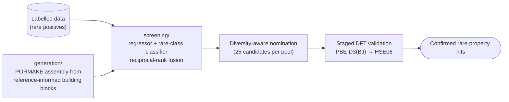

# rare-property-retrieval

**An enrichment-driven machine-learning workflow for discovering materials with rare target
properties under a fixed budget of expensive validations** — demonstrated by retrieving
low-band-gap metal–organic frameworks (HSE06 $E_\mathrm{g} \le 1$ eV, under 1% of labelled
data) and confirming them with hybrid-functional DFT.

Accompanies the paper *Enrichment-driven discovery of low-band-gap metal–organic frameworks
with pretrained porous-material representations* (see [Citation](#citation)).
Author: Ege Yiğit Erbil, Koç University.

## The idea

When positives are rare and high-fidelity labels are expensive, the useful objective is not
predicting every value accurately — it is concentrating the few true positives at the top of a
short validation queue. This workflow combines a fine-tuned property regressor with a
rare-class classifier trained on frozen pretrained embeddings, fuses their rankings by
reciprocal-rank fusion, probes model disagreement as an explicit exploration signal, and
selects a chemically diverse shortlist for first-principles validation.

Demonstrated outcome (paper): **122× enrichment** over random selection at a 25-structure
budget on a held-out partition; **40** HSE06 validations drawn from **23,363** ranked
candidates confirmed **8** low-band-gap MOFs — 3 from the unlabelled QMOF pool and 5 newly
generated frameworks absent from four major MOF databases.



## Repository layout

| Path | Contents | Guide |
|---|---|---|
| [`screening/`](screening/) | Model training (PMTransformer fine-tuning, ExtraTrees on frozen embeddings), rank fusion, evaluation, and diversity-aware nomination on known structures | [`screening/README.md`](screening/README.md) |
| [`generation/`](generation/) | Reference-informed PORMAKE assembly of new candidates, screening with the trained models, nomination, and the four-stage VASP validation cascade | [`generation/README.md`](generation/README.md) |
| [`env/`](env/) | Pinned pip freezes of the two paper environments (fine-tuning and analysis) |  |

## Reproducing the paper

Every procedure described in the paper's Methods maps to a documented, runnable step:

1. **Screening arm** — [`screening/`](screening/README.md#reproducing-the-paper), Steps 0–7:
   preprocess the labelled set, train the models on the committed exact split, reproduce the
   held-out enrichment numbers, and nominate 25 diverse candidates from the unlabelled pool.
2. **Generation arm** — [`generation/`](generation/README.md#reproducing-the-paper),
   Steps 1–26: assemble the candidate database from the committed building-block libraries,
   screen it with the models trained in step 1, nominate 25 diverse candidates, and run the
   PBE-D3(BJ) → HSE06 cascade.

## Applying it to your own rare property

The pipeline is property- and dataset-agnostic. Four things change: the **label files**
(plain JSON, structure ID → scalar), the **positive-class threshold** (one parameter), the
**representation** (any per-structure embedding NPZ), and the **validation oracle** (any
scarce, costly measurement). Details:
[screening/README.md → *Applying the pipeline to other rare-event discovery tasks*](screening/README.md#applying-the-pipeline-to-other-rare-event-discovery-tasks)
and [generation/README.md → *Beyond low-band-gap MOFs*](generation/README.md#beyond-low-band-gap-mofs).

## Code, not results

This repository contains **code and workflow only**. The exact train/val/test membership
lists and pinned environments are committed (they are required inputs for reproduction); all
result artifacts — ranked screening tables, curated hit tables, confirmed-hit structures,
embedding archives, and the complete DFT inputs and outputs for every completed validation —
are distributed separately (see the paper's Data availability statement).

## Built on

[PORMAKE](https://github.com/Sangwon91/PORMAKE) and
[bulk_pormake_generation](https://github.com/Yeonghun1675/bulk_pormake_generation) (reticular
structure assembly), [MOFTransformer / PMTransformer](https://github.com/hspark1212/MOFTransformer)
(pretrained porous-material representation), the
[QMOF Database](https://github.com/Andrew-S-Rosen/QMOF) (HSE06 band gaps),
[DScribe](https://github.com/SINGROUP/dscribe), [pymatgen](https://pymatgen.org/),
[Open Babel](https://openbabel.org/), [scikit-learn](https://scikit-learn.org/), and VASP.

## Citation

> Erbil, E. Y. *et al.* Enrichment-driven discovery of low-band-gap metal–organic frameworks
> with pretrained porous-material representations. *Manuscript in preparation* (2026).

```bibtex
@article{erbil2026lowgapmof,
  title   = {Enrichment-driven discovery of low-band-gap metal--organic frameworks
             with pretrained porous-material representations},
  author  = {Erbil, Ege Yi{\u{g}}it and others},
  year    = {2026},
  note    = {Manuscript in preparation}
}
@misc{rare-property-retrieval,
  title  = {rare-property-retrieval: an enrichment-driven workflow for discovering
            materials with rare target properties},
  author = {Erbil, Ege Yi{\u{g}}it},
  year   = {2026},
  note   = {Ko\c{c} University},
  url    = {https://github.com/EYErbil/rare-property-retrieval}
}
```
<!-- TODO: update author list, journal/DOI, and year once the paper is published. -->

## License

Released under the [MIT License](LICENSE) © 2025 Ege Yiğit Erbil, Koç University.
