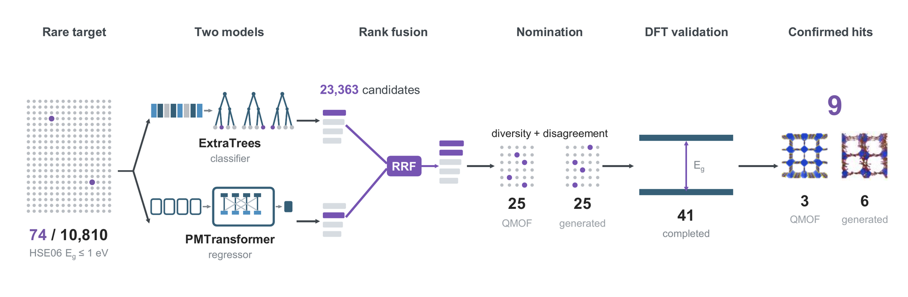
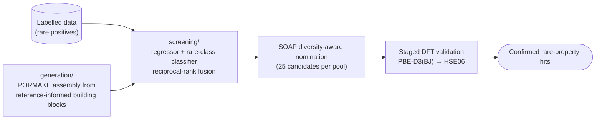

# rare-property-retrieval

**An enrichment-driven machine-learning workflow for discovering materials with rare target
properties under a fixed budget of expensive validations** — demonstrated by retrieving
low-band-gap metal–organic frameworks (HSE06 $E_\mathrm{g} \le 1$ eV, under 1% of labelled
data) and confirming them with hybrid-functional DFT.

Accompanies the paper *Enrichment-driven discovery of low-band-gap metal–organic frameworks*
by Ege Yiğit Erbil, Ömer Veysel Çağatan and Büşra Dereli (see [Citation](#citation)).
Code author: Ege Yiğit Erbil, Koç University.



<sub>Only 74 of the 10,810 HSE06-labelled QMOF structures have $E_\mathrm{g} \le 1$ eV (purple). A
fine-tuned PMTransformer regressor and an ExtraTrees classifier trained on frozen embeddings
independently rank 23,363 prospective candidates, and their rankings are combined by
reciprocal-rank fusion (RRF). Diversity- and disagreement-aware nomination selects 25 candidates
from each prospective pool for HSE06 validation. Of the 50 nominated candidates, 41 complete
HSE06 validation and nine satisfy $E_\mathrm{g} \le 1$ eV: three QMOF structures and six generated
frameworks. (Figure 1 of the paper; vector version in [`docs/workflow.pdf`](docs/workflow.pdf).)</sub>

## The idea

When positives are rare and high-fidelity labels are expensive, the useful objective is not
predicting every value accurately — it is concentrating the few true positives at the top of a
short validation queue. This workflow combines a fine-tuned property regressor with a
rare-class classifier trained on frozen pretrained embeddings, fuses their rankings by
reciprocal-rank fusion, probes model disagreement as an explicit exploration signal, and
selects a chemically diverse shortlist for first-principles validation. Diversity is measured in a
representation space that is separate from the ranking: the generated-pool nomination applies the
procedure once in SOAP space, while the second-phase QMOF acquisition runs it separately in
PMTransformer-embedding and SOAP spaces. RRF and disagreement determine priority, not geometry.

Demonstrated outcome (paper): **122× enrichment** over random selection at a 25-structure
budget in a retrospective comparison on the labeled test partition; **48** structures were
submitted to the DFT workflow, **41** yielded reportable HSE06 results, and **9** low-band-gap
MOFs were confirmed — 3 from the unlabelled QMOF pool and 6 from the generated pool.



## Repository layout

| Path | Contents | Guide |
|---|---|---|
| [`screening/`](screening/) | Model training (PMTransformer fine-tuning, ExtraTrees on frozen embeddings), rank fusion, evaluation, and diversity-aware nomination on known structures | [`screening/README.md`](screening/README.md) |
| [`generation/`](generation/) | Reference-informed PORMAKE assembly of new candidates, screening with the trained models, nomination, and the four-stage VASP validation cascade | [`generation/README.md`](generation/README.md) |
| [`env/`](env/) | Recorded pip freezes for model fine-tuning and general analysis; see [`env/README.md`](env/README.md) for their scope |  |

## Reproducing the paper

Every procedure described in the paper's Methods maps to a documented, runnable step:

1. **Screening arm** — [`screening/`](screening/README.md#reproducing-the-paper), Steps 0–7:
   preprocess the labelled set, train models on the committed exact split, repeat the
   retrospective test-partition analysis, and nominate candidates from the unlabelled pool.
2. **Generation arm** — [`generation/`](generation/README.md#reproducing-the-paper),
   Steps 1–26: assemble the candidate database from the committed building-block libraries,
   screen it with the models trained in step 1, nominate 25 diverse candidates, and run the
   PBE-D3(BJ) → HSE06 cascade.

A fresh training run is a computational replication, not a bitwise reconstruction of the paper
rankings: trained checkpoints and prediction CSVs are not distributed, and stochastic training can
change numerical scores and ranks. Likewise, random PORMAKE sampling constructs a new generated
pool. The exact 13,802 paper-pool identities can instead be materialized from the released SOAP
descriptor archive with `generation/scripts/materialize_generated_pool_manifest.py`.

## Applying it to your own rare property

The pipeline is property- and dataset-agnostic. Four things change: the **label files**
(plain JSON, structure ID → scalar), the **positive-class threshold** (one parameter), the
**representation** (any per-structure embedding NPZ), and the **validation oracle** (any
scarce, costly measurement). Details:
[screening/README.md → *Applying the pipeline to other rare-event discovery tasks*](screening/README.md#applying-the-pipeline-to-other-rare-event-discovery-tasks)
and [generation/README.md → *Beyond low-band-gap MOFs*](generation/README.md#beyond-low-band-gap-mofs).

## Code, not results

This repository contains **code and workflow only**. The exact train/validation/test partition membership
lists and the retained fine-tuning and general-analysis environment records are committed. Derived
CSV files, ranked tables, curated result tables, plots, trained checkpoints, and legacy nomination
archives are not distributed. The code recomputes these artifacts for a fresh run, but without the
paper checkpoints and prediction CSVs it does not promise numerically identical scores or ranks.
The Zenodo deposit contains
only the SOAP and frozen pretrained PMTransformer embedding archives, the PORMAKE structure files
of the 13,802-member generated pool, and the DFT calculation directories for the 25 QMOF-pool and
23 generated submissions (without licensed `POTCAR` files).

The labeled split was designed **before any task-specific training** from distances in the frozen
pretrained PMTransformer embedding space, whose fixed local-and-global geometry distributes the
rare positive chemistries without label-trained leakage. The test partition was excluded from
model fitting, but it was used retrospectively to compare model and fusion choices and is therefore
not described as an untouched external benchmark.

## Built on

[PORMAKE](https://github.com/Sangwon91/PORMAKE) and
[bulk_pormake_generation](https://github.com/Yeonghun1675/bulk_pormake_generation) (reticular
structure assembly), [MOFTransformer / PMTransformer](https://github.com/hspark1212/MOFTransformer)
(pretrained porous-material representation), the
[QMOF Database](https://github.com/Andrew-S-Rosen/QMOF) (HSE06 band gaps),
[DScribe](https://github.com/SINGROUP/dscribe), [pymatgen](https://pymatgen.org/),
[Open Babel](https://openbabel.org/), [scikit-learn](https://scikit-learn.org/), and VASP.

## Data licensing and provenance

The [MIT License](LICENSE) covers the author-written software. Data, derived metadata, bundled
third-party materials, and their source-specific terms are documented separately in
[`DATA_AND_THIRD_PARTY_NOTICES.md`](DATA_AND_THIRD_PARTY_NOTICES.md). The large archival data
release also carries a collection-level data license, provenance table, and SHA-256 manifest.

## Citation

> Erbil, E. Y., Çağatan, Ö. V. & Dereli, B. Enrichment-driven discovery of low-band-gap
> metal–organic frameworks. *Manuscript in preparation* (2026).

```bibtex
@article{erbil2026lowgapmof,
  title   = {Enrichment-driven discovery of low-band-gap metal--organic frameworks},
  author  = {Erbil, Ege Yi{\u{g}}it and \c{C}a\u{g}atan, {\"O}mer Veysel and Dereli, B{\"u}\c{s}ra},
  year    = {2026},
  note    = {Manuscript in preparation}
}
```
<!-- TODO: update journal, volume and DOI once the paper is published. -->

## License

Released under the [MIT License](LICENSE) © 2025 Ege Yiğit Erbil, Koç University.
