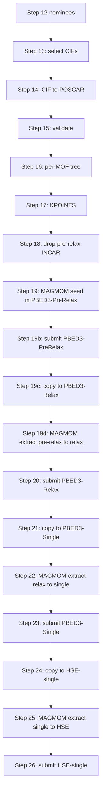

# DFT validation workflow — from nominated CIFs to HSE06 band gaps (Steps 13–26)

Continues from Step 12 of [REPLICATION.md](REPLICATION.md): turns each nominee into a
four-stage VASP cascade (PBED3-PreRelax → PBED3-Relax → PBED3-Single → HSE-single) with
MAGMOM management between stages. Common failure modes: [TROUBLESHOOTING.md](TROUBLESHOOTING.md).

---

## Post-nomination DFT workflow

The generated-pool paper nomination is the single SOAP-space output from Step 12. SOAP supplies
structural geometry for both the RRF-prioritized main tier and the disagreement-prioritized
exploration tier; there is no PMTransformer-diversity nomination list for the generated pool. Of
the 25 generated nominees, two
lanthanide-containing structures were excluded before submission, leaving 23 generated DFT
directories in the release record.

This section turns each Step 12 nominee into a VASP-ready four-stage cascade
(**PBED3-PreRelax → PBED3-Relax → PBED3-Single → HSE-single**) and explains how the helper
scripts under [`scripts/Dft-After-nomination/`](scripts/Dft-After-nomination/)
chain together. Run all `python3 ...` commands from `REPO_ROOT`. The `.sh`
wrappers are direct cluster examples with hard-coded absolute paths; edit those
paths to your `DFT_WORK_ROOT` before running.

### The idea (why four stages and where MAGMOM comes from)

Every nominee runs the same staged cascade so that magnetic order, geometry,
and electronic structure converge consistently before the expensive HSE step:

1. **PBED3-PreRelax** — a lighter pre-relaxation stage that prepares geometry
   for the main relax while keeping the same per-MOF stage path contract.
   `MAGMOM` is *seeded* here per element from chemically sensible defaults
   (`Mn`, `Fe`, `Cr` ≈ 5; `Co` ≈ 3; `Ni` ≈ 2; closed-shell elements 0;
   lanthanides high-spin) with optional AFM sign alternation.
2. **PBED3-Relax** — full geometry optimization with PBE-D3(BJ), `ISPIN=2`.
   `MAGMOM` is *extracted* from the finished PBED3-PreRelax `OUTCAR` and
   written into the relax `INCAR`.
3. **PBED3-Single** — single-point at the relaxed geometry, restarted from
   `CONTCAR` / `CHGCAR` / `WAVECAR`. `MAGMOM` is now *extracted* from the
   converged PBED3-Relax `OUTCAR` and pinned into the single-point `INCAR`,
   so the spin pattern that the relaxation actually settled on survives into
   the next stage.
4. **HSE-single** — HSE06 single-point that reuses the PBED3-Single charge
   density (`ICHARG=1`) and wavefunctions. `MAGMOM` is again *extracted*,
   this time from the PBED3-Single `OUTCAR` into the HSE `INCAR`.

`MAGMOM` is therefore touched **four times**: once as a seed in pre-relax,
then extracted pre-relax -> relax, then extracted at every later stage
transition (relax -> single, single -> HSE). Two
subcommands of one script handle all of that:

- [`vasp_magmom_manager.py seed`](scripts/Dft-After-nomination/magmom_manager/vasp_magmom_manager.py)
  — initial element-wise guesses before PBED3-PreRelax.
- [`vasp_magmom_manager.py extract`](scripts/Dft-After-nomination/magmom_manager/vasp_magmom_manager.py)
  — read the final `magnetization (x)` block from a finished `OUTCAR`,
  compress it into `n*value` runs, and rewrite `MAGMOM` in the next stage's
  `INCAR` (placed right after `ISPIN`).

### Per-MOF working layout

Every helper assumes one folder per MOF directly under `DFT_WORK_ROOT`, with
stage subfolders that are populated incrementally by the workflow:

```text
DFT_WORK_ROOT/
  <mof_name>/
    PBED3-PreRelax/ (Step 16: POSCAR; 17: KPOINTS; 18a: pre-relax INCAR; 19a: MAGMOM seed; 19b: submit)
      POSCAR
      KPOINTS
      INCAR
      POTCAR        ← you supply
      *.sh          ← exactly one job script
    PBED3-Relax/   (Step 19c creates this from PBED3-PreRelax; 19d adds MAGMOM; 20 submits)
      POSCAR
      KPOINTS
      INCAR
      POTCAR        ← you supply
      *.sh          ← exactly one job script
    PBED3-Single/  (Step 21 creates this from PBED3-Relax; 22 adds MAGMOM; 23 submits)
    HSE-single/    (Step 24 creates this from PBED3-Single; 25 adds MAGMOM; 26 submits)
```

The mass-submit and copy helpers iterate the **immediate children** of `ROOT`
and skip a folder named `copy`, so keep `DFT_WORK_ROOT` clean of anything
that is not a MOF directory.



---

### Step 13 — Select nominated CIFs for DFT

Script: [`scripts/Dft-After-nomination/select_cifs_from_list.py`](scripts/Dft-After-nomination/select_cifs_from_list.py)

Pulls only the CIFs you nominated in Step 12 (`FINAL_TOP25_diverse.txt` or
`COMBINED_top25.txt`) out of your full generated set.

```bash
cd REPO_ROOT
python scripts/Dft-After-nomination/select_cifs_from_list.py \
  --source REPO_ROOT/generated_cifs/small_30A_200atom \
  --list REPO_ROOT/paper_results/nomination-SOAP/FINAL_TOP25_diverse.txt \
  --output REPO_ROOT/dft_after_nomination/selected_cifs \
  --overwrite
```

**Outputs:** `REPO_ROOT/dft_after_nomination/selected_cifs/*.cif` plus a
console summary of copied / missing / ambiguous names.

Matching tries exact CIF stem first, then partial filename containment. If a
nominee is missing or ambiguous, the script exits nonzero so you can fix the
list before doing anything irreversible.

---

### Step 14 — Convert selected CIFs to POSCAR

Script: [`scripts/Dft-After-nomination/cif_dir_to_poscar.py`](scripts/Dft-After-nomination/cif_dir_to_poscar.py)

```bash
cd REPO_ROOT
python scripts/Dft-After-nomination/cif_dir_to_poscar.py \
  --input REPO_ROOT/dft_after_nomination/selected_cifs \
  --output REPO_ROOT/dft_after_nomination/poscars \
  --overwrite
```

**Outputs:**

- `REPO_ROOT/dft_after_nomination/poscars/<name>/POSCAR`
- `REPO_ROOT/dft_after_nomination/poscars/conversion_report.csv`

The conversion uses `pymatgen` but keeps the CIF as faithful as possible: no
primitive-cell reduction, no atom sorting, fractional output, no
fractional-coordinate rounding. Use `--flat` only if you actually want
`poscars/<name>.POSCAR` files instead of one folder per structure.

---

### Step 15 — Validate CIF/POSCAR consistency

Script: [`scripts/Dft-After-nomination/validate_cif_poscar_dirs.py`](scripts/Dft-After-nomination/validate_cif_poscar_dirs.py)

```bash
cd REPO_ROOT
python scripts/Dft-After-nomination/validate_cif_poscar_dirs.py \
  --cifs REPO_ROOT/dft_after_nomination/selected_cifs \
  --poscars REPO_ROOT/dft_after_nomination/poscars \
  --report REPO_ROOT/dft_after_nomination/validation_report.csv
```

The validator checks formula, site count, lattice lengths/angles, and
fractional coordinates (with periodic wrapping). Atom order is assumed to be
preserved between CIF and POSCAR — true for the faithful conversion path
above. Investigate every `[FAIL]` before continuing.

---

### Step 16 — Build the per-MOF DFT working tree

Create one folder per MOF inside `DFT_WORK_ROOT` and place the POSCAR inside
a `PBED3-PreRelax` subfolder. A simple Bash loop after Step 14:

```bash
mkdir -p DFT_WORK_ROOT
for d in REPO_ROOT/dft_after_nomination/poscars/*/; do
  name=$(basename "$d")
  mkdir -p "DFT_WORK_ROOT/$name/PBED3-PreRelax"
  cp "$d/POSCAR" "DFT_WORK_ROOT/$name/PBED3-PreRelax/POSCAR"
done
```

Then add **per-MOF** files that this repository does not provide:

- `POTCAR` (assemble from your VASP PSP set, ordered to match the POSCAR
  element line),
- exactly **one** Slurm job script (`*.sh`) per stage folder.

A working Slurm template lives at
[`scripts/Dft-After-nomination/copy/to_relax_step1/vasp_job_template.sh`](scripts/Dft-After-nomination/copy/to_relax_step1/vasp_job_template.sh)
(`module load vasp/6.5.1`, `mpirun -np 32 vasp_std`); copy and adapt it for
your cluster.

---

### Step 17 — Generate KPOINTS for every MOF

Script: [`scripts/Dft-After-nomination/kpoint_maker.py`](scripts/Dft-After-nomination/kpoint_maker.py)

```bash
cd REPO_ROOT
python scripts/Dft-After-nomination/kpoint_maker.py \
  --root DFT_WORK_ROOT \
  --kppa 500 \
  --style auto \
  --overwrite \
  --report DFT_WORK_ROOT/kpoints_report.csv
```

`kpoint_maker.py` recursively finds every `POSCAR` under `--root`. At this
point only `<mof>/PBED3-PreRelax/POSCAR` exists, so each `PBED3-PreRelax` gets a
matching `KPOINTS`. Later stages **inherit** that file through the copy
helpers in Steps 19c, 21, and 24, so you only run `kpoint_maker.py` once.

- `--kppa 500` matches the Rosen/QMOF KPPRA target.
- `--style auto` writes `Gamma` whenever any direction is `1` or any value is
  odd, otherwise `Monkhorst-Pack`.

A pinned-path bash example exists at
[`scripts/Dft-After-nomination/Kpoint-generator.sh`](scripts/Dft-After-nomination/Kpoint-generator.sh);
it already calls `kpoint_maker.py` directly — just edit its `--root`/`--report` paths to your
`DFT_WORK_ROOT`, or use the canonical command above.

---

### Step 18 — Drop the PBED3-PreRelax INCAR template

The pre-relax `INCAR` template lives at
[`scripts/Dft-After-nomination/copy/to_prerelax_step0/INCAR`](scripts/Dft-After-nomination/copy/to_prerelax_step0/INCAR)
and encodes:

- PBE-D3(BJ): `GGA=PE`, `IVDW=12`,
- pre-relaxation: `NSW=150`, `IBRION=2`, `ISIF=2`, `POTIM=0.15`, `EDIFFG=-0.05`,
- electronic defaults: `PREC=Normal`, `ALGO=Normal`, `NELM=120`, `EDIFF=1E-5`,
- spin: `ISPIN=2`, `NUPDOWN=-1` (MAGMOM placeholder is filled in Step 19),
- output: `LCHARG=.TRUE.`, `LWAVE=.TRUE.`.

`MAGMOM` is **not yet** in the template; it is added in Step 19.

```bash
# Optional: ROOT=/path/to/DFT_WORK_ROOT bash ...
bash scripts/Dft-After-nomination/copy/to_prerelax_step0/starter.sh
```

The helper backs up any existing `INCAR` as `INCAR.bak_before_prerelax_copy`
and overwrites it with the template inside every `PBED3-PreRelax` folder it
finds.

---

### Step 19 — Seed MAGMOM into every PBED3-PreRelax INCAR

`vasp_magmom_manager.py seed` parses each `PBED3-PreRelax/POSCAR` (VASP5 format
with element symbols on line 6 is required), looks up default starting
moments per element, and inserts a compact

```text
MAGMOM = n1*v1 n2*v2 ...
```

line right after `ISPIN` in the corresponding `INCAR`:

```bash
cd REPO_ROOT
python3 scripts/Dft-After-nomination/magmom_manager/vasp_magmom_manager.py seed \
  --root DFT_WORK_ROOT \
  --stage PBED3-PreRelax \
  --afm \
  --override Cu=1.0 Nd=3.0 U=3.0 Zn=0.0 \
  --backup \
  --write
```

- Drop `--write` for a dry run that only prints the proposed `MAGMOM` per MOF.
- `--override Element=value` overrides the default seed for specific elements.
- `--afm` alternates ± across consecutive sites of each magnetic element to
  encourage AFM solutions; remove it for FM-only seeds.
- `--backup` writes `INCAR.bak` next to each modified file.

A wrapper for this stage is available at
[`scripts/Dft-After-nomination/magmom_manager/magmom_manager_before_prerelax.sh`](scripts/Dft-After-nomination/magmom_manager/magmom_manager_before_prerelax.sh).

---

### Step 19b — Mass submit PBED3-PreRelax

```bash
# Optional: ROOT=/path/to/DFT_WORK_ROOT STAGE=PBED3-PreRelax bash ...
bash scripts/Dft-After-nomination/copy/mass_submit/submit_prerelax.sh
```

Use [`scripts/Dft-After-nomination/copy/mass_submit/status_prerelax.sh`](scripts/Dft-After-nomination/copy/mass_submit/status_prerelax.sh)
to monitor this stage with the same OUTCAR bucket logic as `status_relax.sh`.

---

### Step 19c — Carry pre-relaxed files into PBED3-Relax

```bash
# Optional: ROOT=/path/to/DFT_WORK_ROOT bash ...
bash scripts/Dft-After-nomination/copy/to_relax_step1/copy_completed_prerelax_to_relax.sh
```

For each MOF with a non-empty `PBED3-PreRelax/CONTCAR`, this:

- creates `PBED3-Relax/` if missing,
- copies `CONTCAR -> POSCAR`, plus `POTCAR`, `KPOINTS` and (if present) `CHGCAR`/`WAVECAR`,
- copies stage `*.sh` scripts from pre-relax,
- backs up existing relax `INCAR` as `INCAR.bak_before_relax_from_prerelax_copy`,
- overwrites relax `INCAR` with the template in `to_relax_step1/INCAR`.

---

### Step 19d — Extract MAGMOM from PBED3-PreRelax OUTCAR into PBED3-Relax INCAR

```bash
cd REPO_ROOT
python3 scripts/Dft-After-nomination/magmom_manager/vasp_magmom_manager.py extract \
  --root DFT_WORK_ROOT \
  --source-stage PBED3-PreRelax \
  --target-stage PBED3-Relax \
  --backup \
  --write
```

A wrapper for this handoff is available at
[`scripts/Dft-After-nomination/magmom_manager/magmom_manager_before_relax_from_prerelax.sh`](scripts/Dft-After-nomination/magmom_manager/magmom_manager_before_relax_from_prerelax.sh).

---

### Step 20 — Mass submit PBED3-Relax

```bash
# Optional: ROOT=/path/to/DFT_WORK_ROOT STAGE=PBED3-Relax bash ...
bash scripts/Dft-After-nomination/copy/mass_submit/mass_submit_better_relax.sh
```

For every MOF, this `sbatch`'s the single `.sh` inside `PBED3-Relax` with
`--chdir` set to that folder. A folder is **skipped** if:

- `OUTCAR` already contains VASP's `General timing and accounting informations`
  line (= already finished),
- `AECCAR0` exists but `OUTCAR` is incomplete (manual inspection),
- a matching job is already queued for `$USER`,
- any of `INCAR` / `POSCAR` / `POTCAR` / `KPOINTS` is missing or empty,
- the stage folder does not contain exactly one `.sh` job script.

Wait for relaxations to finish before continuing.

**Monitoring relax progress:** [`scripts/Dft-After-nomination/copy/mass_submit/status_relax.sh`](scripts/Dft-After-nomination/copy/mass_submit/status_relax.sh) is a practical way to see how the relax stage is going. It walks `ROOT` (default: your generated-MOFs tree), checks `squeue` for duplicate jobs, and classifies each `PBED3-Relax/OUTCAR` using VASP’s `General timing and accounting informations` line plus your workflow’s max-ionic-step marker (`Iteration 249(`). You get uncapped MOF lists for successful completions, step-limit cases that should be resubmitted, crash-style folders with no end marker, small-distance warnings, and a short per-MOF flag line for the “clean finish” bucket. Run it on the login node after relaxing starts, for example:

```bash
cd REPO_ROOT
# Optional: ROOT=/path/to/your/DFT_WORK_ROOT STAGE=PBED3-Relax bash ...
bash scripts/Dft-After-nomination/copy/mass_submit/status_relax.sh
```

**Smarter mass resubmit:** [`scripts/Dft-After-nomination/copy/mass_submit/mass_submit_better_relax.sh`](scripts/Dft-After-nomination/copy/mass_submit/mass_submit_better_relax.sh) uses the **same** decision logic as `status_relax.sh` but actually drives `sbatch` (same `SUBMIT` / `SKIP` echo style as the older submit helper). It is the better choice when you need to **resubmit** relaxations: it avoids resubmitting jobs already in the queue, skips finished relaxations cleanly, resubmits step-limit and crash buckets, and for **step-limit only** it copies the current `POSCAR` to `POSCAR.bak_before_maxstep_contcar`, runs `mv CONTCAR POSCAR`, checks that `CONTCAR` is gone, `POSCAR` is non-empty, and the new `POSCAR` byte size matches the old `CONTCAR` (otherwise it restores `POSCAR` from the backup and skips submit). That all happens **before** `sbatch` so the next run starts from the relaxed geometry. Export `ROOT` / `STAGE` when you run it if you need non-default paths.

---

### Step 21 — Carry relaxed files into PBED3-Single

```bash
# Optional: ROOT=/path/to/DFT_WORK_ROOT bash ...
bash scripts/Dft-After-nomination/copy/to_pbe_single_Step2/copy_completed_relax_to_pbe_single.sh
```

For each MOF with a non-empty `PBED3-Relax/CONTCAR`, this:

- creates `PBED3-Single/`,
- copies `CONTCAR -> POSCAR`, plus `CHGCAR`, `WAVECAR`, `KPOINTS`, `POTCAR`,
- carries the stage `.sh` job script from `PBED3-Relax`,
- backs up any existing `INCAR` as `INCAR.bak_before_pbe_single_copy` and
  overwrites it with the PBED3-Single template
  ([`scripts/Dft-After-nomination/copy/to_pbe_single_Step2/INCAR`](scripts/Dft-After-nomination/copy/to_pbe_single_Step2/INCAR);
  `NSW=0`, `ISPIN=2`, no `MAGMOM` yet).

`KPOINTS` is inherited from `PBED3-Relax`; you do **not** rerun
`kpoint_maker.py`.

---

### Step 22 — Extract MAGMOM from PBED3-Relax OUTCAR into PBED3-Single INCAR

This is the second MAGMOM extraction: carry the **actual** site moments from
the main relaxation into the PBE single-point.

```bash
cd REPO_ROOT
python3 scripts/Dft-After-nomination/magmom_manager/vasp_magmom_manager.py extract \
  --root DFT_WORK_ROOT \
  --source-stage PBED3-Relax \
  --target-stage PBED3-Single \
  --backup \
  --write
```

The extractor reads the **last** `magnetization (x)` block in each MOF's
`PBED3-Relax/OUTCAR`, collapses repeated values into compact `n*value` runs,
removes any prior `MAGMOM` line in the target `INCAR`, and inserts the new
line immediately after `ISPIN`. If `target_stage/POSCAR` is present (it is,
from Step 21), the OUTCAR ion count must match.

A wrapper is committed at
[`scripts/Dft-After-nomination/magmom_manager/magmom_manager_beforePBE-single.sh`](scripts/Dft-After-nomination/magmom_manager/magmom_manager_beforePBE-single.sh)
(uses `--source-stage PBED3-Relax --target-stage PBED3-Single`; edit the
hard-coded path when needed).

---

### Step 23 — Mass submit PBED3-Single

```bash
# Edit ROOT="..." at the top of submit_pbe_single.sh first.
bash scripts/Dft-After-nomination/copy/mass_submit/submit_pbe_single.sh
```

Same skip rules as Step 20, applied to the `PBED3-Single` stage. Wait for
all single-points to finish.

---

### Step 24 — Carry single-point files into HSE-single

```bash
# Optional: ROOT=/path/to/DFT_WORK_ROOT bash ...
bash scripts/Dft-After-nomination/copy/to_hse_step3/copy_completed_pbe_single_to_hse_single.sh
```

For each MOF with a non-empty `PBED3-Single/POSCAR`, this:

- creates `HSE-single/`,
- copies `POSCAR`, `CHGCAR`, `WAVECAR`, `KPOINTS`, `POTCAR` and any `.sh`,
- backs up any existing `INCAR` as `INCAR.bak_before_hse_copy` and writes the
  HSE template
  ([`scripts/Dft-After-nomination/copy/to_hse_step3/INCAR`](scripts/Dft-After-nomination/copy/to_hse_step3/INCAR);
  `LHFCALC=.TRUE.`, `HFSCREEN=0.2`, `ICHARG=1`, `NSW=0`, `ISPIN=2`).

---

### Step 25 — Extract MAGMOM from PBED3-Single OUTCAR into HSE-single INCAR

This is the third MAGMOM extraction. HSE is sensitive to the spin pattern, so
this step preserves whatever PBE single-point converged to:

```bash
cd REPO_ROOT
python3 scripts/Dft-After-nomination/magmom_manager/vasp_magmom_manager.py extract \
  --root DFT_WORK_ROOT \
  --source-stage PBED3-Single \
  --target-stage HSE-single \
  --backup \
  --write
```

Wrapper:
[`scripts/Dft-After-nomination/magmom_manager/magmom_manager_beforeHSE.sh`](scripts/Dft-After-nomination/magmom_manager/magmom_manager_beforeHSE.sh)
(uses `--source-stage PBED3-Single --target-stage HSE-single`; edit the
hard-coded path when needed).

---

### Step 26 — Mass submit HSE-single

```bash
# Edit ROOT="..." at the top of submit_hse_single.sh first.
bash scripts/Dft-After-nomination/copy/mass_submit/submit_hse_single.sh
```

Same skip rules as Steps 20 and 23. After this stage finishes, harvest band
gaps per MOF from each `HSE-single/OUTCAR` (and DOSCAR/EIGENVAL if you need
finer plots). That is the end of the post-nomination cascade.
