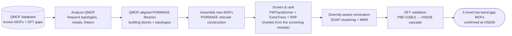
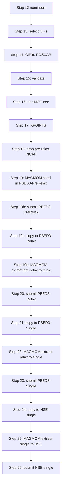

# Generation module — hypothetical-framework assembly and DFT validation

### Assembling new candidate structures with PORMAKE and confirming rare-property hits with hybrid-functional DFT

This is the **generation module** of the [rare-property-retrieval](../) repository — the
generative half of the enrichment-driven workflow, demonstrated on low-band-gap MOF discovery.
Structure assembly builds on [PORMAKE](https://github.com/Sangwon91/PORMAKE) (rule-based
reticular construction); the scoring models are trained in the screening module:

> | Module | Role |
> |---|---|
> | [`screening/`](../screening/) | Trains the PMTransformer regressor + ExtraTrees classifier and screens *known* structures |
> | **`generation/`** *(this module)* | **Generates** new candidates, screens them with the trained models, and runs the **DFT** validation |
>
> Paper: *Enrichment-driven discovery of low-band-gap metal–organic frameworks with pretrained
> porous-material representations* (see [Citation](#citation)). Author: Ege Yiğit Erbil, Koç University.

---

## What problem does this solve?

Metal–organic frameworks (MOFs) with **narrow electronic band gaps** (HSE06 $E_\mathrm{g} \le 1$ eV)
are valuable for optoelectronics, photocatalysis, sensing, and energy conversion — but they are
**extremely rare** (under 1% of the labelled [QMOF](https://github.com/Andrew-S-Rosen/QMOF)
database) and the reliable hybrid-functional (HSE06) calculations needed to confirm them are
expensive. Searching only *known* frameworks is therefore limiting.

This repository takes the complementary route: it **invents new, chemically realistic MOFs** and
funnels them down to a handful worth the cost of DFT. Concretely, it

1. **mines QMOF** for the topologies, metal nodes, and organic linkers that real MOFs are made of,
2. **assembles brand-new hypothetical frameworks** from those building blocks with
   [PORMAKE](https://github.com/Sangwon91/PORMAKE) (rule-based reticular construction — no random
   atom placement),
3. **scores and ranks** every generated structure with the trained models from
   the [screening module](../screening/) (fine-tuned PMTransformer regressor +
   ExtraTrees classifier, fused by reciprocal-rank fusion),
4. **nominates a small, chemically diverse subset** for validation, and
5. **runs the full DFT cascade** (PBE-D3(BJ) → HSE06) and analyses the electronic structure of the
   confirmed hits.

## How it works (conceptual pipeline)



## Results at a glance

Applied to **13,802** generated frameworks, the workflow nominated **25** candidates for
hybrid-functional DFT. Five did not converge within the protocol's iteration limits and were set
aside; the remaining **20** completed the full PBE-D3(BJ) → HSE06 cascade, and **5** were confirmed
with HSE06 band gaps at or below 1 eV — a **25% hit rate** among completed validations (20% if all
selected candidates are counted), versus the sub-1% prevalence in labelled QMOF. **None** of the five matches any structure
(or even a reduced composition) in **QMOF**, **CoRE MOF 2019**, **hMOF**, or **ToBaCCo**, so all
five are novel against the databases searched.

| Label | Net | Node | Linker (neutral acid) | HSE06 $E_\mathrm{g}$ (eV) | In databases? |
|-------|-----|------|------------------------|:---:|:---:|
| `hex+N199+E185` | hex | Cu₄ (8-c) | C₈H₂Br₄O₄ | 0.25 | no |
| `pcu+N273+E44`  | pcu | Mn₃ (6-c) | C₄H₂O₄ | 0.54 | no |
| `hex+N67+E151`  | hex | Cd₃ (8-c) | C₈H₁₂O₄ | 0.56 | no |
| `pcu+N273+E128` | pcu | Mn₃ (6-c) | C₈H₇NO₄ | 0.81 | no |
| `cds+N29+E128`  | cds | Mn₂ (4-c) | C₈H₇NO₄ | 0.83 | no |

Each hit is a force-converged PBE-D3(BJ) local minimum (a metastable structure, not a generator
artefact); thermodynamic stability and experimental synthesizability are beyond this computational
screen.

## How this repository maps to the paper

| Paper section (Methods/Results) | What this repository provides |
|---|---|
| *Generated MOF database construction* | `scripts/analyze_qmof.py`, `scripts/build_custom_dirs.py`, `bulk_pormake_generation/make_candidates.py`, `scripts/build_materials_batched.py` |
| *Candidate selection for validation* | `nominate_diverse_dft.py` (SOAP clustering + MMR + uncertainty) |
| *Selected candidates sample diverse regions …* (chemical-space figures) | `scripts/soap_analysis/`, `scripts/pmtransformer_analysis/`, `qmof_pool_analysis/` |
| *DFT protocol* (PBE-D3(BJ) → HSE06) | `scripts/Dft-After-nomination/` (four-stage VASP cascade + MAGMOM manager) |
| *Electronic-structure analysis* (projected DOS) | `DOS_analysis/` |
| *Building-block and linker identification* | [`scripts/resolve_linker_smiles.py`](scripts/resolve_linker_smiles.py) — Open Babel SMILES/InChI/InChIKey from the PORMAKE building-block bond graphs |
| *Stability and novelty assessment* | [`scripts/novelty/novelty_check_multidb.py`](scripts/novelty/novelty_check_multidb.py) — `pymatgen` `StructureMatcher` vs QMOF, CoRE MOF 2019, hMOF, ToBaCCo |
| Main-text hit tables + the five confirmed-hit CIFs | results archive — see the paper's Data availability |

## What's already included (you don't rebuild the QMOF generation space)

The QMOF-informed assembly space is **committed to this repository**, so you can start generating
immediately without re-mining QMOF:

| Provided | Contents |
|----------|----------|
| `qmof.csv` | The QMOF release table — source of the topology / metal / linker distributions. |
| `qmof_bb_dir/` | The building-block library: **506 metal-node SBUs** (`N*.xyz`) and **229 organic edges/linkers** (`E*.xyz`, including augmented `E9xxx` linkers). |
| `qmof_topo_dir/` | **42 net topologies** (`.cgd`: `pcu`, `hex`, `cds`, `dia`, `fcu`, `sod`, `nbo`, `acs`, …). |
| `qmof_analysis/` | The QMOF-derived whitelists (`selected_{topologies,metals,linkers}.txt`), frequency counts, and `coverage_report.md`. |

The **only** generation input you must create yourself is the RMSD node↔topology compatibility table
**`data/rmsd_qmof.pickle`** (not committed — it is large and fully derived). Build it once with
`build_rmsd_table.sh` before Step 2. Rebuilding the libraries above (Step 1) is **optional** — do it only if
you want to change the QMOF coverage thresholds.

## Reproducing the paper

A full reproduction uses **both modules of this repository**. Train the models in
[`screening/`](../screening/) first (see its “Reproducing the paper”), then run this module:

1. **Install** this module's `requirements.txt`. Set `TRAIN_ROOT` to the `screening/` module
   directory (it holds `train_regressor.py` and the trained `experiments/`).
2. **(Optional) Step 1** — rebuild `qmof_bb_dir/` and `qmof_topo_dir/` from `qmof.csv`
   (`analyze_qmof.py` → `build_custom_dirs.py`). Skip it — they are already provided.
3. **Step 2** — `build_rmsd_table.sh` → `data/rmsd_qmof.pickle`, then `make_candidates.py` (Slurm wrapper: `make_candidates.sh`) → candidate strings.
4. **Step 3** — `build_materials_batched.py` → the generated CIF database (≈13,802 structures).
5. **Step 4** — `prepare_moftransformer_test_only.py` → MOFTransformer-ready dataset.
6. **Steps 5–7** — SOAP and PMTransformer chemical-space comparison figures (optional).
7. **Steps 8–10** — extract embeddings, run NN inference (`--base_dir TRAIN_ROOT`) and ML inference with
   the models trained in `screening/`.
8. **Step 12** — `nominate_diverse_dft.py` → the 25 diversity-aware candidates.
9. **Steps 13–26** — the PBE-D3(BJ) → HSE06 DFT cascade (20 of the 25 complete within the
   protocol's iteration limits) → the **5 confirmed low-band-gap hits**.

## Beyond low-band-gap MOFs

The generate–screen–validate loop in this repository is property- and dataset-agnostic:

- **Generation** imitates whatever reference chemistry the whitelists define (next section) —
  PORMAKE assembly makes no reference to band gaps or any other target property.
- **Screening** consumes any scoring model that emits one score per structure; the ranking,
  reciprocal-rank fusion, and diversity-aware nomination make no assumption about the property
  being screened.
- **Validation** is a staged VASP protocol (PBE-D3(BJ) relaxation → hybrid single point) whose
  acceptance criterion is read from the converged calculation. Band gaps are one choice; any
  observable computable from the same cascade — formation energetics, magnetic order, projected
  densities of states — can serve instead.

Together with the [`screening/`](../screening/) module, this constitutes a general pipeline for
rare-event materials discovery under a fixed budget of expensive validations.

> **Naming note for other properties.** The `*_bandgaps_regression.json` label filenames and
> the `bandgaps` / `bandgaps_regression` downstream tags are fixed pipeline identifiers shared
> by both repositories. When screening a different property, keep these names and replace the
> stored values — do not rename the files.

## Using your own reference dataset (not just QMOF)

QMOF is only the **default** reference set — the generator itself is dataset-agnostic. The chemistry it
imitates is defined entirely by three plain-text whitelists (`selected_topologies.txt`,
`selected_metals.txt`, `selected_linkers.txt`), and the construction step (`make_candidates.py` /
`build_materials.py`) simply consumes whatever `--bb-dir` / `--topo-dir` you give it. There are three
ways to point the pipeline at your own reference MOFs.

### Option A — your dataset as a CSV (recommended)

`analyze_qmof.py` accepts **any** CSV; the column names default to QMOF's MOFid columns but are fully
overridable. Each row needs a topology code, a list of node SMILES (with bracketed metals, e.g.
`"['[Zn]', '[Cu]']"`), and a list of organic-linker SMILES; the pore-geometry columns are optional.

```bash
cd REPO_ROOT
# 1. Mine YOUR table for the frequent topologies / metals / linkers
python scripts/analyze_qmof.py \
  --csv /path/to/your_dataset.csv \
  --out my_analysis \
  --topology-col your_topology_column \
  --nodes-col    your_node_smiles_column \
  --linkers-col  your_linker_smiles_column \
  --pld-col your_pld_column --lcd-col your_lcd_column      # omit these two if you have no pore data

# 2. Build PORMAKE libraries restricted to YOUR chemistry
python scripts/build_custom_dirs.py \
  --analysis-dir my_analysis \
  --topo-out my_topo_dir \
  --bb-out   my_bb_dir

# 3. Generate exactly as in Steps 2-3, pointing at your own dirs
python bulk_pormake_generation/rmsd_calculated_node.py \
  --save data/rmsd_mine.pickle --bb-dir my_bb_dir --topo-dir my_topo_dir
python bulk_pormake_generation/make_candidates.py -n 20000 --max-n-atoms 200 \
  --pre-defined-list data/rmsd_mine.pickle --bb-dir my_bb_dir --topo-dir my_topo_dir \
  --save data/candidates_mine.txt   # -n = candidate strings drawn; build filters reduce this
python scripts/build_materials_batched.py --candidates data/candidates_mine.txt \
  --bb-dir my_bb_dir --topo-dir my_topo_dir \
  --save-dir generated_cifs/mine_small --large-dir generated_cifs/mine_large \
  --cutoff 30.0 --chunk-size 200
```

If a column name is wrong, `analyze_qmof.py` stops and prints the columns it actually found.

### Option B — supply the whitelists directly (any source format)

If your reference data isn't a tidy CSV, skip `analyze_qmof.py` and write the three whitelist files
yourself, then run `build_custom_dirs.py` as above. The formats are trivial — **one item per line**:

| File | Contents |
|------|----------|
| `selected_topologies.txt` | RCSR-style net codes that exist in PORMAKE (e.g. `pcu`, `dia`, `cds`). |
| `selected_metals.txt` | Element symbols of the metals to keep in node SBUs (e.g. `Zn`, `Cu`, `Mn`). |
| `selected_linkers.txt` | Canonical organic-linker SMILES used to (optionally) augment the edge library. |

### Option C — bring your own building blocks

If you already have PORMAKE-format node/edge `.xyz` files and `.cgd` topologies, skip the analysis
entirely and pass your own `--bb-dir` / `--topo-dir` straight to `make_candidates.py` /
`build_materials.py`.

> **What never changes:** the node↔topology RMSD matching, atom-count limits, the cell-size filter, the
> ML screening, and the DFT cascade are all reference-agnostic — only the *whitelists* (i.e. the
> building-block and topology libraries) differ.

## Code, not results

This repository contains the **code and workflow only** — no result files. The exact package
versions used for the paper are frozen in [`env/`](env/) (`requirements_finetuning.txt` and
`requirements_analysis.txt`); the top-level `requirements.txt` remains the permissive
quick-install list; the exact package versions used for the paper are frozen at the repository
root in [`../env/`](../env/). The paper's exact train/val/test split JSONs are committed in the
screening module, [`../screening/data/splits/`](../screening/data/splits/strategy_d_farthest_point/).

All result artifacts — the five HSE06-confirmed hit CIFs, curated hit tables, full ranked
screening tables, embedding archives, and the complete DFT inputs and outputs for every
completed validation — are distributed separately (see the paper's Data availability).

## Large files via Globus (and the `PhaseN` names)

The embedding/descriptor archives and all raw DFT calculation files are **not stored in this
repository** — they are shared via Globus (see the paper's Data availability). After downloading,
restore each archive to the path below; a `README.md` placeholder marks each location.

| Globus file | Restore to | Meaning |
|------|------|---------|
| `pmt_embeddings_qmof_labeled.npz` | `embeddings/` | PMTransformer embeddings of the **labelled** QMOF set |
| `pmt_embeddings_qmof_unlabeled.npz` | `embeddings/` | PMTransformer embeddings of the **unlabelled** QMOF screening pool |
| `pmt_embeddings_qmof_all.npz` | `embeddings/` | Labelled + unlabelled QMOF embedded in **one** aligned forward pass (reference cache) |
| `soap_descriptors_sparse.npz` | `soap_analysis/` | Cached SOAP descriptors (96 MB — too close to GitHub's 100 MB hard limit) |
| DFT stage folders (per validated MOF) | your `DFT_WORK_ROOT` | Complete PBED3-PreRelax / PBED3-Relax / PBED3-Single / HSE-single inputs and outputs |

(Historical provenance strings may refer to the embedding archives by their original working
names `Phase5_embeddings.npz`, `Phase6_embeddings.npz`, and `all_embeddings.npz`.)

---

## Full replication guide (PORMAKE generation + QMOF analysis + DFT prep)

The remainder of this document is the **step-by-step replication manual** — the single source of
truth for reproducing the workflow end-to-end, from PORMAKE candidate generation through DFT-ready
VASP input preparation.

Read sections **in order**. Replace every `REPO_ROOT` with the absolute path to **this** git clone (the folder that contains `bulk_pormake_generation/`, `scripts/`, `nominate_diverse_dft.py`, etc.).

---

## Table of contents

1. [What this pipeline produces](#what-this-pipeline-produces)
2. [Prerequisites (hardware, data, software)](#prerequisites-hardware-data-software)
3. [Path and convention](#path-and-convention)
4. [Replication workflow — follow these steps in order](#replication-workflow--follow-these-steps-in-order)
5. [Post-nomination DFT workflow](#post-nomination-dft-workflow)
6. [Appendix A — `.npz` keys (`embedding_key`)](#appendix-a--npz-keys-embedding_key)
7. [Appendix B — Optional Slurm wrappers](#appendix-b--optional-slurm-wrappers)
8. [Appendix C — Troubleshooting](#appendix-c--troubleshooting)

---

## What this pipeline produces

| Stage | Main artifacts |
|-------|----------------|
| QMOF-aligned PORMAKE libraries | `qmof_bb_dir/`, `qmof_topo_dir/`, `qmof_analysis/` |
| Generated CIFs | `generated_cifs/small_30A_200atom/*.cif` (and paired `large/` tree) |
| MOFTransformer-ready generated data | `generated_cifs/PMtransformer_Files/` (`test/` + JSONs) |
| SOAP vs QMOF | `soap_umap_generated_vs_qmof.*`, `qmof_soap_descriptors.npz`, `generated_soap_descriptors.npz`, summaries |
| SOAP split UMAP | `soap_umap_generated_vs_qmof_splits.*`, split summary JSON |
| PMTransformer vs QMOF | `pmt_umap_generated_vs_qmof.*`, `qmof_pmt_embeddings.npz`, `generated_pmt_embeddings.npz`, `pmt_comparison_summary.json` |
| NN inference (trained regressor) | `inference_predictions.csv` |
| ML inference on embeddings | `<method>/test_predictions.csv` |
| DFT nomination | `FINAL_TOP25_diverse.txt`, `COMBINED_top25.txt`, `diversity_report.md`, UMAP plots |
| Post-nomination VASP prep | selected CIFs, POSCAR folders, `conversion_report.csv`, validation CSVs, `KPOINTS`, `PBED3-PreRelax` / `PBED3-Relax` / `PBED3-Single` / `HSE-single` folders with stage `INCAR` and MAGMOM-ready inputs |

---

## Prerequisites (hardware, data, software)

### Hardware

- **CIF generation**: CPU; use batched build if you hit OOM.
- **SOAP + UMAP**: often **RAM-bound** (64G+ typical for large sets); GPU rarely helps.
- **PMTransformer forward passes / NN inference**: **GPU strongly recommended** (CUDA).
- **DFT preparation / VASP execution**: POSCAR/KPOINTS/MAGMOM preparation is CPU-light; actual VASP runs require your cluster's VASP, POTCAR, MPI, and scheduler setup.

### Data you must obtain yourself

1. **`qmof.csv`** — QMOF database release table, read by `scripts/analyze_qmof.py` (see its
   docstring). **Already committed** at `REPO_ROOT/qmof.csv` — re-download from the
   [QMOF Database](https://github.com/Andrew-S-Rosen/QMOF) only if you want a newer release.

2. **QMOF CIFs for SOAP** — A directory of `.cif` files for structures you treat as the QMOF reference set (subset or full). Used only when computing SOAP from CIFs (`--qmof-cif-dir`). Same basename conventions as your workflow expects.

3. **Train/val/test split JSONs** — For split-colored SOAP/PMT figures and nomination alignment, directories containing:

   `train_bandgaps_regression.json`, `val_bandgaps_regression.json`, `test_bandgaps_regression.json`

   (paths passed as `--labeled-splits-dir` / used by analysis scripts as documented).
   **The paper's exact split is committed in the screening module** at
   [`../screening/data/splits/strategy_d_farthest_point/`](../screening/data/splits/strategy_d_farthest_point/) — point `--labeled-splits-dir` there.

4. **Trained NN experiment** — Checkpoint(s) under `TRAIN_ROOT/experiments/<exp_name>/` where `TRAIN_ROOT` is a directory that contains **`train_regressor.py`** next to `experiments/` — normally the [`../screening/`](../screening/) module after its Step 2 has been run. Used by `scripts/re_inference/run_inference.py` via `--base_dir`.

5. **Trained ML embedding classifiers** — Directory tree with one subfolder per method (`extra_trees/`, `random_forest/`, …), each containing `model.joblib` and/or `artifacts.joblib`. You pass this tree as **`--clf_dir`** to `scripts/re_inference/reinfer_ml.py` (see Step 10); its built-in default `--clf_dir` is only a placeholder, so supply your own path.

6. **PMTransformer embedding `.npz` for nomination / ML scoring** — Must contain **`cif_ids`** and **`embeddings`** (768-dim CLS), e.g. `generated_pmt_embeddings.npz` (generated pool, from Step 7) or `pmt_embeddings_qmof_all.npz` (QMOF reference cache, via Globus). Produced by your unified extraction pipeline (see **Step 8**).

7. **DFT runtime inputs** — For the post-nomination VASP workflow you must supply any licensed or site-specific files yourself, especially **`POTCAR`** files and cluster job scripts/modules. This repo provides helper templates and preparation scripts, but it does **not** distribute POTCARs or run VASP.

### Software environment

From repo root, typical cluster setup:

```bash
module purge
module load cuda/12.3 cudnn/8.9.5/cuda-12.x python/3.9.5
source /path/to/your/venv/bin/activate
```

Install Python packages as needed for each stage:

| Stage | Packages |
|-------|----------|
| `analyze_qmof.py` | `pandas` |
| PORMAKE generation | `pormake` (see upstream repo) |
| MOFTransformer prep + PMTransformer | `moftransformer`, GRIDAY (`moftransformer install-griday`) |
| SOAP scripts | `numpy`, `scikit-learn`, `umap-learn`, `matplotlib`, ASE/`dscribe` as required by your SOAP stack |
| NN inference | `torch`, `pytorch_lightning`, `moftransformer` |
| ML inference | `numpy`, `joblib`, `scikit-learn` |
| Nomination | `numpy`, `scikit-learn`, `matplotlib`, `umap-learn` |
| Post-nomination DFT prep | `pymatgen`, `numpy`; shell wrappers assume Bash + Slurm + VASP on a cluster |

---

## Path and convention

- **`REPO_ROOT`** — This repository’s root (contains `README.md`, `scripts/`, `nominate_diverse_dft.py`).
- **`TRAIN_ROOT`** — Directory that contains **`train_regressor.py`** and **`experiments/`** (passed as `--base_dir` to NN inference) — normally the `screening/` module of this repository.
- **`DFT_WORK_ROOT`** — Your scratch/work directory for VASP folders after nomination. A typical layout is one MOF folder per nominee, with stage subfolders such as `PBED3-PreRelax`, `PBED3-Relax`, `PBED3-Single`, and `HSE-single`.
- **Working directory**: Run all `python …` commands from **`REPO_ROOT`** unless a script docstring says otherwise (so relative paths like `data/…`, `qmof_bb_dir/` resolve correctly).

---

## Replication workflow — follow these steps in order

### Step 1 — QMOF-aligned topology and building-block libraries

Requires `REPO_ROOT/qmof.csv` in place.

```bash
cd REPO_ROOT
python scripts/analyze_qmof.py
python scripts/build_custom_dirs.py
python scripts/verify_custom_dirs.py
```

**Outputs:**

- `qmof_analysis/` (counts, selected topology/metal/linker lists)
- `qmof_topo_dir/` (`.cgd` topologies)
- `qmof_bb_dir/` (filtered `.xyz` building blocks)

---

### Step 2 — Generate candidate strings

**Prerequisite — RMSD node/topology compatibility table.** `make_candidates.py` draws nodes from a
precomputed pickle that lists, per topology, the building-block nodes whose connection points fit
within an RMSD tolerance (≤ 0.3). Build it once with `rmsd_calculated_node.py` (wrapped by the
top-level `build_rmsd_table.sh`), which writes `data/rmsd_qmof.pickle`.

```bash
cd REPO_ROOT
python bulk_pormake_generation/make_candidates.py \
  -n 20000 \
  --max-n-atoms 200 \
  --has-metal True \
  --pre-defined-list data/rmsd_qmof.pickle \
  --bb-dir qmof_bb_dir \
  --topo-dir qmof_topo_dir \
  --save data/candidates_qmof_13k_200atom.txt
```

> `-n` is the number of **candidate strings** drawn, not the number of structures that survive.
> Candidate sampling is stochastic (not seeded) and the build stage (Step 3) discards
> candidates that fail assembly or the cell-size filters, so 20,000 candidates reduced to the
> paper's 13,802 successfully built, screenable structures. Exact counts will vary between
> runs; the paper's exact candidate list and generated CIF database are archived via Globus
> (Data availability).

> The output flag is `-s` / `--save` (there is **no** `--output`). `--has-metal` defaults to `True`;
> due to an argparse quirk (`type=bool`) passing `--has-metal False` does *not* disable the metal
> requirement, so leave it at the default.

**Output:** `data/candidates_qmof_13k_200atom.txt`

---

### Step 3 — Build generated CIFs (OOM-safe)

```bash
cd REPO_ROOT
python scripts/build_materials_batched.py \
  --candidates data/candidates_qmof_13k_200atom.txt \
  --bb-dir qmof_bb_dir \
  --topo-dir qmof_topo_dir \
  --save-dir generated_cifs/small_30A_200atom \
  --large-dir generated_cifs/large_30A_200atom \
  --cutoff 30.0 \
  --chunk-size 200
```

**Outputs:**

- `generated_cifs/small_30A_200atom/*.cif`
- `generated_cifs/large_30A_200atom/*.cif` (structures routed to large cell)

Cell-size handling (in `build_materials.py`): structures whose **smallest** lattice length is below a
hardcoded **4.5 Å** are skipped, and the rest are routed to `--save-dir` when their **largest** lattice
length is `< --cutoff` (here 30 Å), otherwise to `--large-dir`. Resume: existing names are skipped
unless you force rebuild (see `build_materials_batched.py --help`).

---

### Step 4 — Build MOFTransformer-ready dataset from generated CIFs

This produces grid/graphdata and split folders used by PMTransformer **embedding extraction** and by **NN inference** on the generated set.

```bash
cd REPO_ROOT
python scripts/prepare_moftransformer_test_only.py \
  --cif-dir REPO_ROOT/generated_cifs/small_30A_200atom \
  --output-dataset-dir REPO_ROOT/generated_cifs/PMtransformer_Files \
  --downstream bandgaps \
  --default-target-value 0.0 \
  --overwrite-raw-json
```

**Outputs (under `--output-dataset-dir`):**

- `total/` — preprocessed tensors + copied `.cif`
- `train/`, `val/`, `test/` — split layout (`test/` holds structures for test-only routing)
- `train_bandgaps.json`, `val_bandgaps.json`, `test_bandgaps.json`

For downstream scripts, align **`--downstream`** with this preparation (`bandgaps` here ⇒ pass **`--downstream bandgaps`** to PMTransformer compare / NN inference when those scripts default to `bandgaps_regression`).

---

### Step 5 — SOAP comparison vs QMOF (figures + caches)

Script: `scripts/soap_analysis/compare_generated_vs_qmof.py`

You must supply **either** cached SOAP `.npz` **or** a CIF directory for each side (QMOF and generated). See `--help`. Typical modes:

#### 5A — Cold start (compute SOAP from CIF directories)

Writes `qmof_soap_descriptors.npz` and `generated_soap_descriptors.npz` **inside `--output_dir`**.

```bash
cd REPO_ROOT
python scripts/soap_analysis/compare_generated_vs_qmof.py \
  --qmof-cif-dir /path/to/qmof/cifs \
  --generated-cif-dir REPO_ROOT/generated_cifs/small_30A_200atom \
  --output_dir REPO_ROOT/soap_analysis/generated_vs_qmof \
  --save_umap_cache
```

#### 5B — Cached QMOF SOAP + generated from CIF (common after first run)

```bash
cd REPO_ROOT
python scripts/soap_analysis/compare_generated_vs_qmof.py \
  --qmof-cache REPO_ROOT/soap_analysis/generated_vs_qmof/qmof_soap_descriptors.npz \
  --generated-cif-dir REPO_ROOT/generated_cifs/small_30A_200atom \
  --output_dir REPO_ROOT/soap_analysis/generated_vs_qmof \
  --save_umap_cache
```

#### 5C — Both sides cached (fastest)

```bash
cd REPO_ROOT
python scripts/soap_analysis/compare_generated_vs_qmof.py \
  --qmof-cache REPO_ROOT/soap_analysis/generated_vs_qmof/qmof_soap_descriptors.npz \
  --generated-cache REPO_ROOT/soap_analysis/generated_vs_qmof/generated_soap_descriptors.npz \
  --output_dir REPO_ROOT/soap_analysis/generated_vs_qmof \
  --save_umap_cache
```

**Key outputs:**

- `soap_umap_generated_vs_qmof.(png|svg|pdf)`
- `soap_umap_density_generated_vs_qmof.(png|svg|pdf)`
- `soap_comparison_summary.json`
- `qmof_soap_descriptors.npz` / `generated_soap_descriptors.npz` (under `--output_dir` when computed)
- Optional `soap_umap_cache.npz` if `--save_umap_cache`

**Note:** Very large SOAP vectors may trigger automatic PCA before UMAP unless `--full-soap-umap` (RAM-heavy). Tunables: `--pca-dim`, `--pca-auto-dim`, `--pca-batch`.

---

### Step 6 — SOAP split-colored UMAP (QMOF train/val/test vs all generated)

Script: `scripts/soap_analysis/compare_generated_vs_qmof_splits.py`

Requires **`--labeled-splits-dir`** with `{train,val,test}_bandgaps_regression.json`. Prefer **cached** `--qmof-cache` + `--generated-cache` on clusters (full SOAP for both sides is memory-heavy).

```bash
cd REPO_ROOT
python scripts/soap_analysis/compare_generated_vs_qmof_splits.py \
  --qmof-cache REPO_ROOT/soap_analysis/generated_vs_qmof/qmof_soap_descriptors.npz \
  --generated-cache REPO_ROOT/soap_analysis/generated_vs_qmof/generated_soap_descriptors.npz \
  --labeled-splits-dir /path/to/new_splits/strategy_d_farthest_point \
  --output_dir REPO_ROOT/soap_analysis/generated_vs_qmof_splits
```

**Outputs:**

- `soap_umap_generated_vs_qmof_splits.(png|svg|pdf)`
- `soap_umap_cache_generated_vs_qmof_splits.npz`
- `soap_generated_vs_qmof_splits_summary.json`

---

### Step 7 — PMTransformer embedding-space comparison (QMOF vs generated)

Script: `scripts/pmtransformer_analysis/compare_generated_vs_qmof.py`

This extracts **768-dim CLS embeddings** with the PMTransformer backbone (`load_path=pmtransformer`) and fits **one** UMAP on **all QMOF + generated**. Optional **`--labeled-splits-dir`** adds split-colored panels using the **same** 2D coordinates (no second UMAP).

**Important:**

- Use **`--generated-cache`** if `generated_pmt_embeddings.npz` already exists to **avoid** redoing the generated forward pass.
- Match **`--downstream`** to how you built `PMtransformer_Files` (Step 4). If you used `--downstream bandgaps`, pass **`--downstream bandgaps`** here (the argparse default in code is `bandgaps_regression`).

```bash
cd REPO_ROOT
python scripts/pmtransformer_analysis/compare_generated_vs_qmof.py \
  --qmof-cache REPO_ROOT/embeddings/pmt_embeddings_qmof_all.npz \
  --generated-data-dir REPO_ROOT/generated_cifs/PMtransformer_Files \
  --generated-split test \
  --downstream bandgaps \
  --labeled-splits-dir /path/to/new_splits/strategy_d_farthest_point \
  --output_dir REPO_ROOT/PmTransformer_analysis/results \
  --save_umap_cache
```

After the first successful run, rerun with caches only:

```bash
cd REPO_ROOT
python scripts/pmtransformer_analysis/compare_generated_vs_qmof.py \
  --qmof-cache REPO_ROOT/embeddings/pmt_embeddings_qmof_all.npz \
  --generated-cache REPO_ROOT/PmTransformer_analysis/results/generated_pmt_embeddings.npz \
  --downstream bandgaps \
  --labeled-splits-dir /path/to/new_splits/strategy_d_farthest_point \
  --output_dir REPO_ROOT/PmTransformer_analysis/results \
  --save_umap_cache
```

**Outputs:**

- `qmof_pmt_embeddings.npz`, `generated_pmt_embeddings.npz` (when extracted from dirs; unchanged if only caches passed)
- `pmt_umap_generated_vs_qmof.(png|svg|pdf)`, `pmt_umap_density_generated_vs_qmof.(png|svg|pdf)`
- If `--labeled-splits-dir`: `pmt_umap_generated_vs_qmof_splits.(png|svg|pdf)`, density variant
- `pmt_comparison_summary.json`
- Optional: `pmt_umap_cache.npz`, `pmt_umap_cache_splits.npz` with `--save_umap_cache`

**NumPy:** On older NumPy, if you see `TypeError: asarray() got an unexpected keyword argument 'copy'`, upgrade NumPy or use the current script from this repo (fixed).

---

### Step 8 — Unified PMTransformer embeddings for **all** structures (optional but recommended for aligned spaces)

If you need **one** `.npz` covering labeled + unlabeled MOFs in the same embedding space, you can adapt the reference implementation:

- [`scripts/extract_all_embeddings_unified.py`](scripts/extract_all_embeddings_unified.py)

This single-forward-pass extractor produced the aligned `pmt_embeddings_qmof_all.npz` reference
cache (distributed via Globus). Copy it next to your `train_regressor` project or adjust `sys.path` as in
your cluster workflow. See the script docstring for full CLI.

---

### Step 9 — NN inference with **your trained regressor** (band-gap predictions CSV)

Script: `scripts/re_inference/run_inference.py`

**Requirements:**

- **`--base_dir`** = directory containing **`train_regressor.py`** and **`experiments/`** (e.g. `TRAIN_ROOT`).
- **`--data_dir`** = MOFTransformer-ready folder with populated **`test/`** and a test JSON (`test_bandgaps.json` or `test_bandgaps_regression.json`; script supports `--downstream auto`).
- **`--output_dir`** = where you want `inference_predictions.csv`.

```bash
cd REPO_ROOT
python scripts/re_inference/run_inference.py \
  --base_dir TRAIN_ROOT \
  --data_dir REPO_ROOT/generated_cifs/PMtransformer_Files \
  --experiments YOUR_EXPERIMENT_NAME \
  --downstream auto \
  --output_dir REPO_ROOT/re_infer/nn/YOUR_EXPERIMENT_NAME
```

**Outputs:**

- `inference_predictions.csv` (columns: `cif_id`, `score`, `predicted_binary`, `true_label`, `mode`)
- `inference_ranked.csv`
- `topK_for_DFT.txt`, `topK_for_DFT.csv` (`--top_k`, default 25)

---

### Step 10 — ML re-inference on an embeddings `.npz`

Script: `scripts/re_inference/reinfer_ml.py`

**Inputs:**

- **`cif_ids`** + **`embeddings`** in one `.npz` file (same format as `predict_with_embedding_classifier.py`).
- Provide **either**:
  - **`--embeddings_path`** — path to that `.npz` (recommended), **or**
  - **`--npz_dir`** — a directory where the script falls back to `<npz_dir>/pmt_embeddings_qmof_unlabeled.npz` (legacy `Phase6_embeddings.npz` also accepted; run `python scripts/re_inference/reinfer_ml.py --help` for the exact lookup).
- **`--clf_dir`** — parent directory of per-method folders (`extra_trees/`, …). Its built-in default is only a non-functional placeholder, so in practice **always pass `--clf_dir`** pointing at your embedding-classifier root.

```bash
cd REPO_ROOT
python scripts/re_inference/reinfer_ml.py \
  --embeddings_path REPO_ROOT/PmTransformer_analysis/results/generated_pmt_embeddings.npz \
  --clf_dir /path/to/embedding_classifiers/strategy_d_farthest_point \
  --output_dir REPO_ROOT/re_infer/ml
```

**Alternative (directory-only embeddings discovery):**

```bash
cd REPO_ROOT
python scripts/re_inference/reinfer_ml.py \
  --npz_dir /path/to/dir_containing_embeddings_npz \
  --clf_dir /path/to/embedding_classifiers/strategy_d_farthest_point \
  --output_dir REPO_ROOT/re_infer/ml
```

**Outputs:**

- `REPO_ROOT/re_infer/ml/<method>/test_predictions.csv`
- `REPO_ROOT/re_infer/ml/<method>/final_results.json`

If `--output_dir` is omitted, files are written **in place** under each method folder in `--clf_dir`.

---

### Step 11 — Optional: plot NN score distribution

```bash
cd REPO_ROOT
python scripts/re_inference/plot_inference_bandgap_distribution.py \
  --csv REPO_ROOT/re_infer/nn/YOUR_EXPERIMENT_NAME/inference_predictions.csv \
  --out REPO_ROOT/re_infer/nn/YOUR_EXPERIMENT_NAME/inference_bandgap_distribution.png
```

---

### Step 12 — Diversity-aware DFT nomination

Script: **`REPO_ROOT/nominate_diverse_dft.py`** (repository root).

> **Two copies exist by design.** Each repository carries its own copy so that each is
> self-contained: this copy was used for the **generated-MOF pool**, the screening module's
> [`discovery/nominate_diverse_dft.py`](../screening/discovery/nominate_diverse_dft.py)
> for the **unlabelled QMOF pool**. Both expose the same CLI (`--embedding_key` /
> `--embedding_label` select the diversity space) and the same strategy set — cluster quota,
> MMR, uncertainty quota, long-tail exploration — differing only in pool-specific reporting.

Run from **`REPO_ROOT`** so imports resolve predictably:

```bash
cd REPO_ROOT
```

You normally run **twice**: once with PMTransformer embeddings as diversity space, once with SOAP descriptors — **same** `--prediction_csvs`, different `--embeddings_path` / `--embedding_key`.

#### Run A — diversity in PMTransformer space

```bash
python nominate_diverse_dft.py \
  --embeddings_path REPO_ROOT/PmTransformer_analysis/results/generated_pmt_embeddings.npz \
  --embedding_key embeddings \
  --embedding_label PMTransformer \
  --prediction_csvs \
    exp364=REPO_ROOT/re_infer/nn/exp364/inference_predictions.csv \
    smote_extra_trees=REPO_ROOT/re_infer/ml/extra_trees/test_predictions.csv \
  --nn_models exp364 \
  --ml_models smote_extra_trees \
  --output_dir /path/to/nomination_pmt_space \
  --pool_size 500 \
  --n_clusters 20 \
  --max_per_cluster 1 \
  --mmr_lambdas 0.2 0.3 0.4 \
  --budget 25 \
  --exploration_budget 5 \
  --exploration_pool_hi 2000 \
  --rrf_k 60 \
  --seed 42
```

Optional: `--soap_embeddings_path /path/to/soap_descriptors_sparse_or_dense.npz` adds SOAP-only **report** statistics; it does **not** switch diversity space unless you use Run B.

#### Run B — diversity in SOAP space

```bash
python nominate_diverse_dft.py \
  --embeddings_path REPO_ROOT/soap_analysis/generated_vs_qmof/generated_soap_descriptors.npz \
  --embedding_key soap_descriptors \
  --embedding_label SOAP \
  --prediction_csvs \
    exp364=REPO_ROOT/re_infer/nn/exp364/inference_predictions.csv \
    smote_extra_trees=REPO_ROOT/re_infer/ml/extra_trees/test_predictions.csv \
  --nn_models exp364 \
  --ml_models smote_extra_trees \
  --output_dir /path/to/nomination_soap_space \
  --pool_size 500 \
  --n_clusters 20 \
  --max_per_cluster 1 \
  --mmr_lambdas 0.2 0.3 0.4 \
  --budget 25 \
  --exploration_budget 5 \
  --exploration_pool_hi 2000 \
  --rrf_k 60 \
  --seed 42
```

**Outputs (each `--output_dir`):**

- `FINAL_TOP25_diverse.txt`, `FINAL_TOP25_diverse.csv` (columns: `rank, cif_id, rrf_rank, strategies_nominating, rank_std, rank_range, nn_ml_disagreement, cluster`)
- `COMBINED_top25.txt` and one file per strategy — `A_cluster_quota_top25.txt`, `B_mmr_lambda{λ}_top25.txt` (one per `--mmr_lambdas` value), `C_uncertainty_quota_top25.txt`, `D_longtail_exploration_top25.txt`
- `shortlist_pool.csv` (the clustered top-`pool_size` shortlist)
- `diversity_report.md`
- `plots/umap_diverse_nominees.png`, `plots/umap_comparison_old_vs_new.png`, `plots/umap_cache.npz`

> Additional optional flags (defaults shown in the runs above): `--alpha 0.5 --beta 0.3 --gamma 0.2`
> weight strategy C's quality / diversity / disagreement terms; `--exploration_pool_lo` (defaults to
> `--pool_size`) and `--exploration_pool_hi` bound the long-tail pool; `--old_nominees` and
> `--umap_cache` enable the old-vs-new comparison plot and faster re-runs.

---

## Post-nomination DFT workflow

This section turns each Step 12 nominee into a VASP-ready four-stage cascade
(**PBED3-PreRelax → PBED3-Relax → PBED3-Single → HSE-single**) and explains how the helper
scripts under [`scripts/Dft-After-nomination/`](scripts/Dft-After-nomination/)
chain together. Run all `python3 ...` commands from `REPO_ROOT`. The `.sh`
wrappers are direct cluster examples with hard-coded absolute paths; edit those
paths to your `DFT_WORK_ROOT` before running.

### The idea (why four stages and where MAGMOM comes from)

Every nominee runs the same staged cascade so that magnetic order, geometry,
and electronic structure converge consistently before the expensive HSE step:

1. **PBED3-PreRelax** — a lighter pre-relaxation stage that prepares geometry
   for the main relax while keeping the same per-MOF stage path contract.
   `MAGMOM` is *seeded* here per element from chemically sensible defaults
   (`Mn`, `Fe`, `Cr` ≈ 5; `Co` ≈ 3; `Ni` ≈ 2; closed-shell elements 0;
   lanthanides high-spin) with optional AFM sign alternation.
2. **PBED3-Relax** — full geometry optimization with PBE-D3(BJ), `ISPIN=2`.
   `MAGMOM` is *extracted* from the finished PBED3-PreRelax `OUTCAR` and
   written into the relax `INCAR`.
3. **PBED3-Single** — single-point at the relaxed geometry, restarted from
   `CONTCAR` / `CHGCAR` / `WAVECAR`. `MAGMOM` is now *extracted* from the
   converged PBED3-Relax `OUTCAR` and pinned into the single-point `INCAR`,
   so the spin pattern that the relaxation actually settled on survives into
   the next stage.
4. **HSE-single** — HSE06 single-point that reuses the PBED3-Single charge
   density (`ICHARG=1`) and wavefunctions. `MAGMOM` is again *extracted*,
   this time from the PBED3-Single `OUTCAR` into the HSE `INCAR`.

`MAGMOM` is therefore touched **four times**: once as a seed in pre-relax,
then extracted pre-relax -> relax, then extracted at every later stage
transition (relax -> single, single -> HSE). Two
subcommands of one script handle all of that:

- [`vasp_magmom_manager.py seed`](scripts/Dft-After-nomination/magmom_manager/vasp_magmom_manager.py)
  — initial element-wise guesses before PBED3-PreRelax.
- [`vasp_magmom_manager.py extract`](scripts/Dft-After-nomination/magmom_manager/vasp_magmom_manager.py)
  — read the final `magnetization (x)` block from a finished `OUTCAR`,
  compress it into `n*value` runs, and rewrite `MAGMOM` in the next stage's
  `INCAR` (placed right after `ISPIN`).

### Per-MOF working layout

Every helper assumes one folder per MOF directly under `DFT_WORK_ROOT`, with
stage subfolders that are populated incrementally by the workflow:

```text
DFT_WORK_ROOT/
  <mof_name>/
    PBED3-PreRelax/ (Step 16: POSCAR; 17: KPOINTS; 18a: pre-relax INCAR; 19a: MAGMOM seed; 19b: submit)
      POSCAR
      KPOINTS
      INCAR
      POTCAR        ← you supply
      *.sh          ← exactly one job script
    PBED3-Relax/   (Step 19c creates this from PBED3-PreRelax; 19d adds MAGMOM; 20 submits)
      POSCAR
      KPOINTS
      INCAR
      POTCAR        ← you supply
      *.sh          ← exactly one job script
    PBED3-Single/  (Step 21 creates this from PBED3-Relax; 22 adds MAGMOM; 23 submits)
    HSE-single/    (Step 24 creates this from PBED3-Single; 25 adds MAGMOM; 26 submits)
```

The mass-submit and copy helpers iterate the **immediate children** of `ROOT`
and skip a folder named `copy`, so keep `DFT_WORK_ROOT` clean of anything
that is not a MOF directory.



---

### Step 13 — Select nominated CIFs for DFT

Script: [`scripts/Dft-After-nomination/select_cifs_from_list.py`](scripts/Dft-After-nomination/select_cifs_from_list.py)

Pulls only the CIFs you nominated in Step 12 (`FINAL_TOP25_diverse.txt` or
`COMBINED_top25.txt`) out of your full generated set.

```bash
cd REPO_ROOT
python scripts/Dft-After-nomination/select_cifs_from_list.py \
  --source REPO_ROOT/generated_cifs/small_30A_200atom \
  --list /path/to/nomination_pmt_space/FINAL_TOP25_diverse.txt \
  --output REPO_ROOT/dft_after_nomination/selected_cifs \
  --overwrite
```

**Outputs:** `REPO_ROOT/dft_after_nomination/selected_cifs/*.cif` plus a
console summary of copied / missing / ambiguous names.

Matching tries exact CIF stem first, then partial filename containment. If a
nominee is missing or ambiguous, the script exits nonzero so you can fix the
list before doing anything irreversible.

---

### Step 14 — Convert selected CIFs to POSCAR

Script: [`scripts/Dft-After-nomination/cif_dir_to_poscar.py`](scripts/Dft-After-nomination/cif_dir_to_poscar.py)

```bash
cd REPO_ROOT
python scripts/Dft-After-nomination/cif_dir_to_poscar.py \
  --input REPO_ROOT/dft_after_nomination/selected_cifs \
  --output REPO_ROOT/dft_after_nomination/poscars \
  --overwrite
```

**Outputs:**

- `REPO_ROOT/dft_after_nomination/poscars/<name>/POSCAR`
- `REPO_ROOT/dft_after_nomination/poscars/conversion_report.csv`

The conversion uses `pymatgen` but keeps the CIF as faithful as possible: no
primitive-cell reduction, no atom sorting, fractional output, no
fractional-coordinate rounding. Use `--flat` only if you actually want
`poscars/<name>.POSCAR` files instead of one folder per structure.

---

### Step 15 — Validate CIF/POSCAR consistency

Script: [`scripts/Dft-After-nomination/validate_cif_poscar_dirs.py`](scripts/Dft-After-nomination/validate_cif_poscar_dirs.py)

```bash
cd REPO_ROOT
python scripts/Dft-After-nomination/validate_cif_poscar_dirs.py \
  --cifs REPO_ROOT/dft_after_nomination/selected_cifs \
  --poscars REPO_ROOT/dft_after_nomination/poscars \
  --report REPO_ROOT/dft_after_nomination/validation_report.csv
```

The validator checks formula, site count, lattice lengths/angles, and
fractional coordinates (with periodic wrapping). Atom order is assumed to be
preserved between CIF and POSCAR — true for the faithful conversion path
above. Investigate every `[FAIL]` before continuing.

---

### Step 16 — Build the per-MOF DFT working tree

Create one folder per MOF inside `DFT_WORK_ROOT` and place the POSCAR inside
a `PBED3-PreRelax` subfolder. A simple Bash loop after Step 14:

```bash
mkdir -p DFT_WORK_ROOT
for d in REPO_ROOT/dft_after_nomination/poscars/*/; do
  name=$(basename "$d")
  mkdir -p "DFT_WORK_ROOT/$name/PBED3-PreRelax"
  cp "$d/POSCAR" "DFT_WORK_ROOT/$name/PBED3-PreRelax/POSCAR"
done
```

Then add **per-MOF** files that this repository does not provide:

- `POTCAR` (assemble from your VASP PSP set, ordered to match the POSCAR
  element line),
- exactly **one** Slurm job script (`*.sh`) per stage folder.

A working Slurm template lives at
[`scripts/Dft-After-nomination/copy/to_relax_step1/vasp_job_template.sh`](scripts/Dft-After-nomination/copy/to_relax_step1/vasp_job_template.sh)
(`module load vasp/6.5.1`, `mpirun -np 32 vasp_std`); copy and adapt it for
your cluster.

---

### Step 17 — Generate KPOINTS for every MOF

Script: [`scripts/Dft-After-nomination/kpoint_maker.py`](scripts/Dft-After-nomination/kpoint_maker.py)

```bash
cd REPO_ROOT
python scripts/Dft-After-nomination/kpoint_maker.py \
  --root DFT_WORK_ROOT \
  --kppa 500 \
  --style auto \
  --overwrite \
  --report DFT_WORK_ROOT/kpoints_report.csv
```

`kpoint_maker.py` recursively finds every `POSCAR` under `--root`. At this
point only `<mof>/PBED3-PreRelax/POSCAR` exists, so each `PBED3-PreRelax` gets a
matching `KPOINTS`. Later stages **inherit** that file through the copy
helpers in Steps 19c, 21, and 24, so you only run `kpoint_maker.py` once.

- `--kppa 500` matches the Rosen/QMOF KPPRA target.
- `--style auto` writes `Gamma` whenever any direction is `1` or any value is
  odd, otherwise `Monkhorst-Pack`.

A pinned-path bash example exists at
[`scripts/Dft-After-nomination/Kpoint-generator.sh`](scripts/Dft-After-nomination/Kpoint-generator.sh);
it already calls `kpoint_maker.py` directly — just edit its `--root`/`--report` paths to your
`DFT_WORK_ROOT`, or use the canonical command above.

---

### Step 18 — Drop the PBED3-PreRelax INCAR template

The pre-relax `INCAR` template lives at
[`scripts/Dft-After-nomination/copy/to_prerelax_step0/INCAR`](scripts/Dft-After-nomination/copy/to_prerelax_step0/INCAR)
and encodes:

- PBE-D3(BJ): `GGA=PE`, `IVDW=12`,
- pre-relaxation: `NSW=150`, `IBRION=2`, `ISIF=2`, `POTIM=0.15`, `EDIFFG=-0.05`,
- electronic defaults: `PREC=Normal`, `ALGO=Normal`, `NELM=120`, `EDIFF=1E-5`,
- spin: `ISPIN=2`, `NUPDOWN=-1` (MAGMOM placeholder is filled in Step 19),
- output: `LCHARG=.TRUE.`, `LWAVE=.TRUE.`.

`MAGMOM` is **not yet** in the template; it is added in Step 19.

```bash
# Optional: ROOT=/path/to/DFT_WORK_ROOT bash ...
bash scripts/Dft-After-nomination/copy/to_prerelax_step0/starter.sh
```

The helper backs up any existing `INCAR` as `INCAR.bak_before_prerelax_copy`
and overwrites it with the template inside every `PBED3-PreRelax` folder it
finds.

---

### Step 19 — Seed MAGMOM into every PBED3-PreRelax INCAR

`vasp_magmom_manager.py seed` parses each `PBED3-PreRelax/POSCAR` (VASP5 format
with element symbols on line 6 is required), looks up default starting
moments per element, and inserts a compact

```text
MAGMOM = n1*v1 n2*v2 ...
```

line right after `ISPIN` in the corresponding `INCAR`:

```bash
cd REPO_ROOT
python3 scripts/Dft-After-nomination/magmom_manager/vasp_magmom_manager.py seed \
  --root DFT_WORK_ROOT \
  --stage PBED3-PreRelax \
  --afm \
  --override Cu=1.0 Nd=3.0 U=3.0 Zn=0.0 \
  --backup \
  --write
```

- Drop `--write` for a dry run that only prints the proposed `MAGMOM` per MOF.
- `--override Element=value` overrides the default seed for specific elements.
- `--afm` alternates ± across consecutive sites of each magnetic element to
  encourage AFM solutions; remove it for FM-only seeds.
- `--backup` writes `INCAR.bak` next to each modified file.

A wrapper for this stage is available at
[`scripts/Dft-After-nomination/magmom_manager/magmom_manager_before_prerelax.sh`](scripts/Dft-After-nomination/magmom_manager/magmom_manager_before_prerelax.sh).

---

### Step 19b — Mass submit PBED3-PreRelax

```bash
# Optional: ROOT=/path/to/DFT_WORK_ROOT STAGE=PBED3-PreRelax bash ...
bash scripts/Dft-After-nomination/copy/mass_submit/submit_prerelax.sh
```

Use [`scripts/Dft-After-nomination/copy/mass_submit/status_prerelax.sh`](scripts/Dft-After-nomination/copy/mass_submit/status_prerelax.sh)
to monitor this stage with the same OUTCAR bucket logic as `status_relax.sh`.

---

### Step 19c — Carry pre-relaxed files into PBED3-Relax

```bash
# Optional: ROOT=/path/to/DFT_WORK_ROOT bash ...
bash scripts/Dft-After-nomination/copy/to_relax_step1/copy_completed_prerelax_to_relax.sh
```

For each MOF with a non-empty `PBED3-PreRelax/CONTCAR`, this:

- creates `PBED3-Relax/` if missing,
- copies `CONTCAR -> POSCAR`, plus `POTCAR`, `KPOINTS` and (if present) `CHGCAR`/`WAVECAR`,
- copies stage `*.sh` scripts from pre-relax,
- backs up existing relax `INCAR` as `INCAR.bak_before_relax_from_prerelax_copy`,
- overwrites relax `INCAR` with the template in `to_relax_step1/INCAR`.

---

### Step 19d — Extract MAGMOM from PBED3-PreRelax OUTCAR into PBED3-Relax INCAR

```bash
cd REPO_ROOT
python3 scripts/Dft-After-nomination/magmom_manager/vasp_magmom_manager.py extract \
  --root DFT_WORK_ROOT \
  --source-stage PBED3-PreRelax \
  --target-stage PBED3-Relax \
  --backup \
  --write
```

A wrapper for this handoff is available at
[`scripts/Dft-After-nomination/magmom_manager/magmom_manager_before_relax_from_prerelax.sh`](scripts/Dft-After-nomination/magmom_manager/magmom_manager_before_relax_from_prerelax.sh).

---

### Step 20 — Mass submit PBED3-Relax

```bash
# Optional: ROOT=/path/to/DFT_WORK_ROOT STAGE=PBED3-Relax bash ...
bash scripts/Dft-After-nomination/copy/mass_submit/mass_submit_better_relax.sh
```

For every MOF, this `sbatch`'s the single `.sh` inside `PBED3-Relax` with
`--chdir` set to that folder. A folder is **skipped** if:

- `OUTCAR` already contains VASP's `General timing and accounting informations`
  line (= already finished),
- `AECCAR0` exists but `OUTCAR` is incomplete (manual inspection),
- a matching job is already queued for `$USER`,
- any of `INCAR` / `POSCAR` / `POTCAR` / `KPOINTS` is missing or empty,
- the stage folder does not contain exactly one `.sh` job script.

Wait for relaxations to finish before continuing.

**Monitoring relax progress:** [`scripts/Dft-After-nomination/copy/mass_submit/status_relax.sh`](scripts/Dft-After-nomination/copy/mass_submit/status_relax.sh) is a practical way to see how the relax stage is going. It walks `ROOT` (default: your generated-MOFs tree), checks `squeue` for duplicate jobs, and classifies each `PBED3-Relax/OUTCAR` using VASP’s `General timing and accounting informations` line plus your workflow’s max-ionic-step marker (`Iteration 249(`). You get uncapped MOF lists for successful completions, step-limit cases that should be resubmitted, crash-style folders with no end marker, small-distance warnings, and a short per-MOF flag line for the “clean finish” bucket. Run it on the login node after relaxing starts, for example:

```bash
cd REPO_ROOT
# Optional: ROOT=/path/to/your/DFT_WORK_ROOT STAGE=PBED3-Relax bash ...
bash scripts/Dft-After-nomination/copy/mass_submit/status_relax.sh
```

**Smarter mass resubmit:** [`scripts/Dft-After-nomination/copy/mass_submit/mass_submit_better_relax.sh`](scripts/Dft-After-nomination/copy/mass_submit/mass_submit_better_relax.sh) uses the **same** decision logic as `status_relax.sh` but actually drives `sbatch` (same `SUBMIT` / `SKIP` echo style as the older submit helper). It is the better choice when you need to **resubmit** relaxations: it avoids resubmitting jobs already in the queue, skips finished relaxations cleanly, resubmits step-limit and crash buckets, and for **step-limit only** it copies the current `POSCAR` to `POSCAR.bak_before_maxstep_contcar`, runs `mv CONTCAR POSCAR`, checks that `CONTCAR` is gone, `POSCAR` is non-empty, and the new `POSCAR` byte size matches the old `CONTCAR` (otherwise it restores `POSCAR` from the backup and skips submit). That all happens **before** `sbatch` so the next run starts from the relaxed geometry. Export `ROOT` / `STAGE` when you run it if you need non-default paths.

---

### Step 21 — Carry relaxed files into PBED3-Single

```bash
# Optional: ROOT=/path/to/DFT_WORK_ROOT bash ...
bash scripts/Dft-After-nomination/copy/to_pbe_single_Step2/copy_completed_relax_to_pbe_single.sh
```

For each MOF with a non-empty `PBED3-Relax/CONTCAR`, this:

- creates `PBED3-Single/`,
- copies `CONTCAR -> POSCAR`, plus `CHGCAR`, `WAVECAR`, `KPOINTS`, `POTCAR`,
- carries the stage `.sh` job script from `PBED3-Relax`,
- backs up any existing `INCAR` as `INCAR.bak_before_pbe_single_copy` and
  overwrites it with the PBED3-Single template
  ([`scripts/Dft-After-nomination/copy/to_pbe_single_Step2/INCAR`](scripts/Dft-After-nomination/copy/to_pbe_single_Step2/INCAR);
  `NSW=0`, `ISPIN=2`, no `MAGMOM` yet).

`KPOINTS` is inherited from `PBED3-Relax`; you do **not** rerun
`kpoint_maker.py`.

---

### Step 22 — Extract MAGMOM from PBED3-Relax OUTCAR into PBED3-Single INCAR

This is the second MAGMOM extraction: carry the **actual** site moments from
the main relaxation into the PBE single-point.

```bash
cd REPO_ROOT
python3 scripts/Dft-After-nomination/magmom_manager/vasp_magmom_manager.py extract \
  --root DFT_WORK_ROOT \
  --source-stage PBED3-Relax \
  --target-stage PBED3-Single \
  --backup \
  --write
```

The extractor reads the **last** `magnetization (x)` block in each MOF's
`PBED3-Relax/OUTCAR`, collapses repeated values into compact `n*value` runs,
removes any prior `MAGMOM` line in the target `INCAR`, and inserts the new
line immediately after `ISPIN`. If `target_stage/POSCAR` is present (it is,
from Step 21), the OUTCAR ion count must match.

A wrapper is committed at
[`scripts/Dft-After-nomination/magmom_manager/magmom_manager_beforePBE-single.sh`](scripts/Dft-After-nomination/magmom_manager/magmom_manager_beforePBE-single.sh)
(uses `--source-stage PBED3-Relax --target-stage PBED3-Single`; edit the
hard-coded path when needed).

---

### Step 23 — Mass submit PBED3-Single

```bash
# Edit ROOT="..." at the top of submit_pbe_single.sh first.
bash scripts/Dft-After-nomination/copy/mass_submit/submit_pbe_single.sh
```

Same skip rules as Step 20, applied to the `PBED3-Single` stage. Wait for
all single-points to finish.

---

### Step 24 — Carry single-point files into HSE-single

```bash
# Optional: ROOT=/path/to/DFT_WORK_ROOT bash ...
bash scripts/Dft-After-nomination/copy/to_hse_step3/copy_completed_pbe_single_to_hse_single.sh
```

For each MOF with a non-empty `PBED3-Single/POSCAR`, this:

- creates `HSE-single/`,
- copies `POSCAR`, `CHGCAR`, `WAVECAR`, `KPOINTS`, `POTCAR` and any `.sh`,
- backs up any existing `INCAR` as `INCAR.bak_before_hse_copy` and writes the
  HSE template
  ([`scripts/Dft-After-nomination/copy/to_hse_step3/INCAR`](scripts/Dft-After-nomination/copy/to_hse_step3/INCAR);
  `LHFCALC=.TRUE.`, `HFSCREEN=0.2`, `ICHARG=1`, `NSW=0`, `ISPIN=2`).

---

### Step 25 — Extract MAGMOM from PBED3-Single OUTCAR into HSE-single INCAR

This is the third MAGMOM extraction. HSE is sensitive to the spin pattern, so
this step preserves whatever PBE single-point converged to:

```bash
cd REPO_ROOT
python3 scripts/Dft-After-nomination/magmom_manager/vasp_magmom_manager.py extract \
  --root DFT_WORK_ROOT \
  --source-stage PBED3-Single \
  --target-stage HSE-single \
  --backup \
  --write
```

Wrapper:
[`scripts/Dft-After-nomination/magmom_manager/magmom_manager_beforeHSE.sh`](scripts/Dft-After-nomination/magmom_manager/magmom_manager_beforeHSE.sh)
(uses `--source-stage PBED3-Single --target-stage HSE-single`; edit the
hard-coded path when needed).

---

### Step 26 — Mass submit HSE-single

```bash
# Edit ROOT="..." at the top of submit_hse_single.sh first.
bash scripts/Dft-After-nomination/copy/mass_submit/submit_hse_single.sh
```

Same skip rules as Steps 20 and 23. After this stage finishes, harvest band
gaps per MOF from each `HSE-single/OUTCAR` (and DOSCAR/EIGENVAL if you need
finer plots). That is the end of the post-nomination cascade.

---

## Appendix A — `.npz` keys (`embedding_key`)

| File role | Typical filename | Matrix key for `--embedding_key` |
|-----------|------------------|-----------------------------------|
| PMTransformer / unified embeddings | `generated_pmt_embeddings.npz`, `pmt_embeddings_qmof_all.npz` | `embeddings` |
| SOAP descriptors | `*_soap_descriptors.npz` from `compare_generated_vs_qmof.py` | `soap_descriptors` |
| ML re-inference / nomination (same matrix as PMTransformer space) | Any `.npz` with `cif_ids` + `embeddings` | `embeddings` |

Always verify keys:

`python -c "import numpy as np; d=np.load('file.npz'); print(d.files)"`

---

## Appendix B — Optional Slurm wrappers

SOAP jobs:

```bash
cd REPO_ROOT
sbatch soap_analysis/Soap-analysis-compare.sh
sbatch soap_analysis/Soap-analysis-compare-cached.sh
```

Create `REPO_ROOT/logs/` before submitting jobs that write `%j.out` / `%j.err` under `logs/`.

DFT helper wrappers:

```bash
cd REPO_ROOT
bash scripts/Dft-After-nomination/copy/to_prerelax_step0/starter.sh
bash scripts/Dft-After-nomination/copy/mass_submit/submit_prerelax.sh
bash scripts/Dft-After-nomination/copy/mass_submit/status_prerelax.sh
bash scripts/Dft-After-nomination/copy/to_relax_step1/copy_completed_prerelax_to_relax.sh
bash scripts/Dft-After-nomination/copy/to_pbe_single_Step2/copy_completed_relax_to_pbe_single.sh
bash scripts/Dft-After-nomination/copy/to_hse_step3/copy_completed_pbe_single_to_hse_single.sh
bash scripts/Dft-After-nomination/magmom_manager/magmom_manager_before_prerelax.sh
bash scripts/Dft-After-nomination/magmom_manager/magmom_manager_before_relax_from_prerelax.sh
bash scripts/Dft-After-nomination/magmom_manager/magmom_manager_beforePBE-single.sh
bash scripts/Dft-After-nomination/magmom_manager/magmom_manager_beforeHSE.sh
bash scripts/Dft-After-nomination/copy/mass_submit/status_relax.sh
bash scripts/Dft-After-nomination/copy/mass_submit/mass_submit_better_relax.sh
bash scripts/Dft-After-nomination/copy/mass_submit/submit_pbe_single.sh
bash scripts/Dft-After-nomination/copy/mass_submit/submit_hse_single.sh
```

Before running any DFT wrapper, edit hard-coded paths and review module, account, partition, and job-script assumptions for your cluster. Prefer the Python entry points in Steps 13-17 for portable CIF/POSCAR/KPOINTS/MAGMOM preparation.

---

## Appendix C — Troubleshooting

| Symptom | What to do |
|---------|------------|
| `qmof.csv` not found | Place QMOF release CSV at `REPO_ROOT/qmof.csv` before Step 1. |
| CIF build OOM | Lower `--chunk-size` in `build_materials_batched.py`. |
| SOAP / UMAP OOM | Use `--qmof-cache` + `--generated-cache`; enable PCA defaults; avoid `--full-soap-umap` on large dims without huge RAM. |
| Split figures show zero matches | Check `--labeled-splits-dir` and **ID strings** vs embedding/QMOF IDs. |
| PMTransformer compare recomputes generated forever | Pass **`--generated-cache`** pointing at existing `generated_pmt_embeddings.npz`. |
| `downstream` / JSON name mismatch | Align `prepare_moftransformer_test_only.py --downstream` with `compare_generated_vs_qmof.py --downstream` and NN inference (`--downstream auto` helps). |
| `TypeError: asarray() ... copy` | Upgrade NumPy or use current `compare_generated_vs_qmof.py` from this repo. |
| NN inference cannot import `train_regressor` | Point `--base_dir` at the project that **contains** `train_regressor.py` (not necessarily `REPO_ROOT`). |
| ML re-inference finds no methods or writes to wrong place | Pass explicit **`--clf_dir`** to your embedding-classifier root; omit **`--output_dir`** only if you intend to overwrite files inside each method folder. |
| `FileNotFoundError` after `--npz_dir` | Use **`--embeddings_path`** to an explicit `.npz`, or ensure `<npz_dir>/pmt_embeddings_qmof_unlabeled.npz` exists (see `python scripts/re_inference/reinfer_ml.py --help`). |
| GRIDAY errors | `moftransformer install-griday` in the active environment. |
| Step 13: nominated CIF not copied | Confirm `FINAL_TOP25_diverse.txt` / `COMBINED_top25.txt` lists exact CIF stems; `select_cifs_from_list.py` exits nonzero on missing or ambiguous partial matches. |
| Step 14: CIF to POSCAR conversion fails | Inspect `conversion_report.csv`; malformed CIFs and occupancy issues are raised by `pymatgen.CifParser` (kept faithful — no auto-fix). |
| Step 15: validation `[FAIL]` rows | Look at `same_formula` / `same_num_sites` first, then lattice and fractional-coord tolerances. The validator assumes preserved atom order between CIF and POSCAR. |
| Step 17: `Kpoint-generator.sh` uses pinned absolute paths | It already calls `kpoint_maker.py`; edit its `--root`/`--report` to your `DFT_WORK_ROOT`, or run `python scripts/Dft-After-nomination/kpoint_maker.py --root DFT_WORK_ROOT ...` directly. |
| Step 17: KPOINTS appear in unexpected folders | `kpoint_maker.py` recursively writes `KPOINTS` next to **every** `POSCAR` under `--root`; aim `--root` at only the intended tree (run it once before Step 21). |
| Step 18: helper does nothing | The bash wrapper iterates `ROOT`'s immediate children excluding `copy/`; edit `ROOT="..."` to your `DFT_WORK_ROOT`, and ensure each MOF has a `PBED3-PreRelax` subfolder already. |
| Step 19: MAGMOM manager rejects POSCAR | `vasp_magmom_manager.py` requires VASP5 POSCAR with element symbols on line 6; old VASP4 count-only POSCARs are explicitly rejected. |
| Step 19 / 19d / 22 / 25: MAGMOM wrapper fails on Python 3.6 | This repo's manager avoids `argparse.add_subparsers(required=True)` for Python 3.6 compatibility. The wrappers call `python3`; edit the command if your cluster needs a specific interpreter path. |
| Steps 22 / 25: extract fails with ion-count mismatch | The OUTCAR moment count must equal the number of atoms in `target_stage/POSCAR`. Make sure Step 21 / Step 24 ran before Step 22 / Step 25, and that `CONTCAR -> POSCAR` actually copied. |
| Steps 20 / 23 / 26: submit helper skips a folder for missing files | Ensure the stage folder has non-empty `INCAR`, `POSCAR`, `POTCAR`, `KPOINTS` and exactly one `.sh` job script. |
| Steps 20 / 23 / 26: submit helper skips a folder with `AECCAR0` | `AECCAR0` plus an incomplete `OUTCAR` is treated as a manual-inspection case before any resubmission; clean up the folder yourself. |
| Steps 20 / 23 / 26: submit helper does not detect a finished job | Completion is detected by the literal line `General timing and accounting informations` in `OUTCAR`; jobs killed before that point are re-submitted. |

---

## Related module

The machine-learning models used here for scoring and ranking are developed, trained, and
benchmarked in the [`screening/`](../screening/) module — diversity-aware ensemble screening of
*known* structures (PMTransformer regressor + ExtraTrees classifier + RRF).

## Acknowledgements & upstream tools

- **[PORMAKE](https://github.com/Sangwon91/PORMAKE)** — rule-based reticular MOF construction.
- **[bulk_pormake_generation](https://github.com/Yeonghun1675/bulk_pormake_generation)** — upstream
  bulk-generation utilities that this repository builds on.
- **[MOFTransformer / PMTransformer](https://github.com/hspark1212/MOFTransformer)** — pretrained
  porous-material representation used for embeddings and band-gap regression.
- **[QMOF Database](https://github.com/Andrew-S-Rosen/QMOF)** — reference MOFs and DFT band gaps.
- **[DScribe](https://github.com/SINGROUP/dscribe)** (SOAP), **[pymatgen](https://pymatgen.org/)**,
  **[Open Babel](https://openbabel.org/)**, **[UMAP](https://github.com/lmcinnes/umap)**, and **VASP**
  for descriptors, structure handling, cheminformatics, visualisation, and DFT.

## Citation

If you use this software, please cite the accompanying paper:

> Erbil, E. Y. *et al.* Enrichment-driven discovery of low-band-gap metal–organic frameworks with
> pretrained porous-material representations. *Manuscript in preparation* (2026).

```bibtex
@article{erbil2026lowgapmof,
  title   = {Enrichment-driven discovery of low-band-gap metal--organic frameworks
             with pretrained porous-material representations},
  author  = {Erbil, Ege Yi{\u{g}}it and others},
  year    = {2026},
  note    = {Manuscript in preparation}
}
```
<!-- TODO: update author list, journal/DOI, and year once the paper is published. -->

To cite this software repository specifically, see the [repository-level README](../README.md).

## License

Released under the [MIT License](../LICENSE) © 2025 Ege Yiğit Erbil, Koç University.
