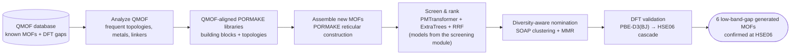

# Generation module — hypothetical-framework assembly and DFT validation

### Assembling new candidate structures with PORMAKE and confirming rare-property hits with hybrid-functional DFT

This is the **generation module** of the [rare-property-retrieval](../) repository — the
generative half of the enrichment-driven workflow, demonstrated on low-band-gap MOF discovery.
Structure assembly builds on [PORMAKE](https://github.com/Sangwon91/PORMAKE) (rule-based
reticular construction); the scoring models are trained in the screening module:

> | Module | Role |
> |---|---|
> | [`screening/`](../screening/) | Trains the PMTransformer regressor + ExtraTrees classifier and screens *known* structures |
> | **`generation/`** *(this module)* | **Generates** new candidates, screens them with the trained models, and runs the **DFT** validation |
>
> Paper: *Enrichment-driven discovery of low-band-gap metal–organic frameworks* (see [Citation](#citation)). Code author: Ege Yiğit Erbil, Koç University.

---

## What problem does this solve?

Metal–organic frameworks (MOFs) with **narrow electronic band gaps** (HSE06 $E_\mathrm{g} \le 1$ eV)
are valuable for optoelectronics, photocatalysis, sensing, and energy conversion — but they are
**extremely rare** (under 1% of the labelled [QMOF](https://github.com/Andrew-S-Rosen/QMOF)
database) and the reliable hybrid-functional (HSE06) calculations needed to confirm them are
expensive. Searching only *known* frameworks is therefore limiting.

This repository takes the complementary route: it **invents new, chemically realistic MOFs** and
funnels them down to a handful worth the cost of DFT. Concretely, it

1. **mines QMOF** for the topologies, metal nodes, and organic linkers that real MOFs are made of,
2. **assembles brand-new hypothetical frameworks** from those building blocks with
   [PORMAKE](https://github.com/Sangwon91/PORMAKE) (rule-based reticular construction — no random
   atom placement),
3. **scores and ranks** every generated structure with the trained models from
   the [screening module](../screening/) (fine-tuned PMTransformer regressor +
   ExtraTrees classifier, fused by reciprocal-rank fusion),
4. **nominates a small, chemically diverse subset** using SOAP as the sole structural-diversity
   coordinate for this generated pool (RRF and disagreement affect priority, not geometry), and
5. **runs the full DFT cascade** (PBE-D3(BJ) → HSE06) and analyses the electronic structure of the
   confirmed hits.

## How it works (conceptual pipeline)



## Results at a glance

Applied to **13,802** generated frameworks, the workflow nominated **25** candidates. Two
lanthanide-containing nominees were excluded before submission, so **23** entered the DFT
workflow; **16** yielded reportable HSE06 results and **6** had band gaps at or below 1 eV. Across
both paper arms, 48 structures were submitted, 41 yielded reportable HSE06 results, and 9 were
confirmed as low-gap (3 QMOF-pool + 6 generated).

Each hit reaches a force-converged PBE-D3(BJ) stationary geometry under the archived protocol.
Without a Hessian or phonon calculation, this does not establish a local minimum or metastability;
dynamical and thermodynamic stability and experimental synthesizability are beyond this
computational screen.

## How this repository maps to the paper

| Paper section (Methods/Results) | What this repository provides |
|---|---|
| *Generated MOF database construction* | `scripts/analyze_reference_db.py`, `scripts/build_custom_dirs.py`, `bulk_pormake_generation/make_candidates.py`, `scripts/build_materials_batched.py` |
| *Candidate selection for validation* | `nominate_diverse_dft.py` (SOAP clustering + MMR + a model-disagreement exploration proxy) |
| *Selected candidates sample diverse regions …* (chemical-space figures) | `scripts/soap_analysis/`, `scripts/pmtransformer_analysis/`, `qmof_pool_analysis/` |
| *DFT protocol* (PBE-D3(BJ) → HSE06) | `scripts/Dft-After-nomination/` (four-stage VASP cascade + MAGMOM manager) |
| *Electronic-structure analysis* (projected DOS) | `DOS_analysis/` |
| *Building-block and linker identification* | [`scripts/resolve_linker_smiles.py`](scripts/resolve_linker_smiles.py) — Open Babel SMILES/InChI/InChIKey from the PORMAKE building-block bond graphs |
| *Stability and novelty assessment* | [`scripts/novelty/novelty_check_multidb.py`](scripts/novelty/novelty_check_multidb.py) — `pymatgen` `StructureMatcher` vs QMOF, CoRE MOF 2019, hMOF, ToBaCCo |
| *Structural relaxation and novelty assessment* (chemical-identity screen) | [`scripts/novelty/chemical_identity_novelty.py`](scripts/novelty/chemical_identity_novelty.py) — net topology + node metal + neutral-parent linker, from MOFid/MOFkey annotations of QMOF, hMOF, ToBaCCo and CoRE MOF 2024 ASR. Complements the StructureMatcher screen above: that one asks whether a hit is the *same material* as a reference, this one whether the *combination of building blocks* is known. Run with `--validate` first — the positive controls establish that a null result means absence rather than insensitivity |
| Main-text and supplementary analyses | code to recompute tables and figures for a run; stale result tables are not distributed, and newly trained models need not reproduce paper ranks numerically |

## Inputs, committed libraries, and the exact paper-pool identity

The QMOF-informed assembly space is **committed to this repository**, so you can start generating
immediately without re-mining QMOF. The public QMOF release table is downloaded separately only
when rebuilding or changing those libraries:

| Input or resource | Contents |
|----------|----------|
| `qmof.csv` (download separately) | Public QMOF release table used to re-mine topology, metal, and linker distributions; not committed or included in Globus. |
| `qmof_bb_dir/` | The building-block library: **506 metal-node SBUs** (`N*.xyz`) and **229 organic edges/linkers** (`E*.xyz`, including augmented `E9xxx` linkers). |
| `qmof_topo_dir/` | **42 net topologies** (`.cgd`: `pcu`, `hex`, `cds`, `dia`, `fcu`, `sod`, `nbo`, `acs`, …). |
| `qmof_analysis/` | The QMOF-derived whitelists (`selected_{topologies,metals,linkers}.txt`), frequency counts, and `coverage_report.md`. |

When using the committed libraries, the generation input you must create is the RMSD node↔topology compatibility table
**`data/rmsd_qmof.pickle`** (not committed — it is large and fully derived). Build it once with
`build_rmsd_table.sh` before Step 2. Rebuilding the libraries above (Step 1) is **optional** — do it only if
you want to change the QMOF coverage thresholds, in which case download `qmof.csv` first.

## Reproducing the paper

A full reproduction uses **both modules of this repository**. Train the models in
[`screening/`](../screening/) first (see its “Reproducing the paper”), then run this module:

1. **Install** this module's `requirements.txt`. Set `TRAIN_ROOT` to the `screening/` module
   directory (it holds `train_regressor.py` and the trained `experiments/`).
2. **Steps 1–12** — follow [REPLICATION.md](REPLICATION.md): (optionally) rebuild the
   QMOF-aligned libraries; either generate a new stochastic candidate database or materialize the
   exact 13,802 paper-pool ID manifest from the released SOAP archive; then preprocess, screen, and
   nominate candidates for the current run.
3. **Steps 13–26** — follow [DFT_WORKFLOW.md](DFT_WORKFLOW.md): the four-stage PBE-D3(BJ) →
   HSE06 cascade for the **23 submitted** generated candidates → **16 reportable results** and
   **6 confirmed low-band-gap hits**.

## Beyond low-band-gap MOFs

The generate–screen–validate loop in this repository is property- and dataset-agnostic:

- **Generation** imitates whatever reference chemistry the whitelists define (next section) —
  PORMAKE assembly makes no reference to band gaps or any other target property.
- **Screening** consumes any scoring model that emits one score per structure; the ranking,
  reciprocal-rank fusion, and diversity-aware nomination make no assumption about the property
  being screened.
- **Validation** is a staged VASP protocol (PBE-D3(BJ) relaxation → hybrid single point) whose
  acceptance criterion is read from the converged calculation. Band gaps are one choice; any
  observable computable from the same cascade — formation energetics, magnetic order, projected
  densities of states — can serve instead.

Together with the [`screening/`](../screening/) module, this constitutes a general pipeline for
rare-event materials discovery under a fixed budget of expensive validations.

> **Naming note for other properties.** The `*_bandgaps_regression.json` label filenames and
> the `bandgaps` / `bandgaps_regression` downstream tags are fixed pipeline identifiers shared
> by both repositories. When screening a different property, keep these names and replace the
> stored values — do not rename the files.

## Generate from your own reference database

QMOF is only the **default** reference set — the generator itself is dataset-agnostic. Point
[`scripts/analyze_reference_db.py`](scripts/analyze_reference_db.py) at any reference database
table and the pipeline extracts its frequent **topologies, metal nodes, and organic linkers**,
builds PORMAKE libraries restricted to that chemistry, and generates new candidates from it —
exactly the procedure the paper applied to QMOF. The chemistry it imitates is defined entirely
by three plain-text whitelists (`selected_topologies.txt`, `selected_metals.txt`,
`selected_linkers.txt`), and the construction step (`make_candidates.py` / `build_materials.py`)
simply consumes whatever `--bb-dir` / `--topo-dir` you give it. There are three entry points,
by decreasing level of automation.

### Option A — your database as a decomposed table (recommended)

`analyze_reference_db.py` accepts **any** CSV; the column names default to QMOF's MOFid columns but are fully
overridable. Each row needs a topology code, a list of node SMILES (with bracketed metals, e.g.
`"['[Zn]', '[Cu]']"`), and a list of organic-linker SMILES; the pore-geometry columns are optional.

> **Starting from raw CIFs?** Deriving topology / node / linker identifiers from crystal
> structures is exactly what the published [MOFid](https://github.com/snurr-group/mofid) tool
> does. Run MOFid over your CIFs, collect its topology and node/linker SMILES output into a CSV,
> and proceed below. (QMOF ships these columns precomputed, which is why the paper's run needs
> no extra step.)

```bash
cd REPO_ROOT
# 1. Mine YOUR table for the frequent topologies / metals / linkers
python scripts/analyze_reference_db.py \
  --csv /path/to/your_dataset.csv \
  --out my_analysis \
  --topology-col your_topology_column \
  --nodes-col    your_node_smiles_column \
  --linkers-col  your_linker_smiles_column \
  --pld-col your_pld_column --lcd-col your_lcd_column      # omit these two if you have no pore data

# 2. Build PORMAKE libraries restricted to YOUR chemistry
python scripts/build_custom_dirs.py \
  --analysis-dir my_analysis \
  --topo-out my_topo_dir \
  --bb-out   my_bb_dir

# 3. Generate exactly as in Steps 2-3, pointing at your own dirs
python bulk_pormake_generation/rmsd_calculated_node.py \
  --save data/rmsd_mine.pickle --bb-dir my_bb_dir --topo-dir my_topo_dir
python bulk_pormake_generation/make_candidates.py -n 20000 --max-n-atoms 200 \
  --pre-defined-list data/rmsd_mine.pickle --bb-dir my_bb_dir --topo-dir my_topo_dir \
  --save data/candidates_mine.txt   # -n = candidate strings drawn; build filters reduce this
python scripts/build_materials_batched.py --candidates data/candidates_mine.txt \
  --bb-dir my_bb_dir --topo-dir my_topo_dir \
  --save-dir generated_cifs/mine_small --large-dir generated_cifs/mine_large \
  --cutoff 30.0 --chunk-size 200
```

If a column name is wrong, `analyze_reference_db.py` stops and prints the columns it actually found.

### Option B — supply the whitelists directly (any source format)

If your reference data isn't a tidy CSV, skip `analyze_reference_db.py` and write the three whitelist files
yourself, then run `build_custom_dirs.py` as above. The formats are trivial — **one item per line**:

| File | Contents |
|------|----------|
| `selected_topologies.txt` | RCSR-style net codes that exist in PORMAKE (e.g. `pcu`, `dia`, `cds`). |
| `selected_metals.txt` | Element symbols of the metals to keep in node SBUs (e.g. `Zn`, `Cu`, `Mn`). |
| `selected_linkers.txt` | Canonical organic-linker SMILES used to (optionally) augment the edge library. |

### Option C — bring your own building blocks

If you already have PORMAKE-format node/edge `.xyz` files and `.cgd` topologies, skip the analysis
entirely and pass your own `--bb-dir` / `--topo-dir` straight to `make_candidates.py` /
`build_materials.py`.

> **What never changes:** the node↔topology RMSD matching, atom-count limits, the cell-size filter, the
> ML screening, and the DFT cascade are all reference-agnostic — only the *whitelists* (i.e. the
> building-block and topology libraries) differ.

## Code, not results

This repository contains the **code and workflow only** — no result files. The retained package
records at the repository root cover model fine-tuning and general analysis
([`../env/`](../env/)); the production SMOTE--ExtraTrees run used scikit-learn 1.6.0, as recorded
in the paper's Supplementary Information, but a separate full freeze of that production
classifier environment was not retained. The top-level `requirements.txt` remains a permissive
quick-install list. The paper's exact train/validation/test partition JSONs are committed in the
screening module, [`../screening/data/splits/`](../screening/data/splits/strategy_d_farthest_point/).

Derived CSVs, ranked lists, curated result tables, plots, trained checkpoints, and legacy
nomination folders are not distributed. The code recomputes them for a fresh run from the public
QMOF source and released large inputs. Because trained checkpoints and prediction CSVs are not
distributed and training is stochastic, a rerun need not reproduce paper scores or ranks
numerically.

## Large files via Globus (and the `PhaseN` names)

Globus contains **only** the frozen pretrained PMTransformer/SOAP archives, the PORMAKE structure
files of the generated pool, and DFT calculation directories (25 QMOF-pool + 23 generated
submissions, including available files for incomplete runs and excluding VASP-licensed `POTCAR`
files). After downloading, restore each archive to the path below; a `README.md` placeholder marks
each location.

| Globus path | Restore to | Meaning |
|------|------|---------|
| `embeddings/qmof_labeled_pmtransformer_embeddings.npz` | `../screening/data/embeddings/embeddings_pretrained.npz` (optionally also `embeddings/`) | PMTransformer embeddings of the **labelled** QMOF set and authoritative paper-split labels |
| `embeddings/qmof_pmtransformer_embeddings.npz` | `embeddings/pmt_embeddings_qmof_all.npz` | Authoritative aligned QMOF cache: 20,371 rows = 10,810 labeled + 9,561 unlabeled |
| `embeddings/generated_pmtransformer_embeddings.npz` | `embeddings/generated_pmt_embeddings.npz` | PMTransformer embeddings of all 13,802 generated structures |
| `soap_descriptors/qmof_soap_descriptors.npz` | `soap_analysis/soap_descriptors_sparse.npz` | QMOF SOAP: 20,370 rows; `core_ERIWAF_freeONLY` is absent |
| `soap_descriptors/generated_soap_descriptors.npz` | `soap_analysis/generated_vs_qmof/` | SOAP descriptors for all 13,802 generated structures |
| `generated_structures/` | `data/generated_structures/` | One PORMAKE CIF per generated-pool member; exactly the 13,802 paper-pool identifiers |
| `dft_validation/` (per submitted MOF) | your `DFT_WORK_ROOT` | Available PBED3-PreRelax / PBED3-Relax / PBED3-Single / HSE-single inputs and outputs for 25 + 23 submissions |

The Globus filenames are descriptive; the *Restore to* column gives the path and filename each
archive must take inside this repository.

The generated SOAP archive is also the authoritative identity record for the paper pool. Materialize
its descriptor-row-aligned, newline-delimited manifest without a separately distributed CSV:

```bash
python scripts/materialize_generated_pool_manifest.py \
  --descriptor-npz soap_analysis/generated_vs_qmof/generated_soap_descriptors.npz \
  --output data/paper_generated_pool_manifest.txt
```

The utility rejects missing/duplicate IDs and any default count other than 13,802, and prints a
SHA-256 checksum of the resulting manifest.

(Historical provenance strings may refer to the embedding archives by their original working
names `Phase5_embeddings.npz`, `Phase6_embeddings.npz`, and `all_embeddings.npz`.)

For the complete QMOF unlabeled pool, select the 9,561 unlabeled IDs from
`pmt_embeddings_qmof_all.npz`. The historical 9,527-row standalone archive is retained only under
the umbrella workspace's local non-release `RESULTS/local_only_archive/` folder and is not part of
Globus.

---

## Detailed guides

The complete, step-numbered manuals live in three companion documents:

| Guide | Covers |
|---|---|
| [REPLICATION.md](REPLICATION.md) | Steps 1–12: reference-database analysis, PORMAKE construction, preprocessing, chemical-space analyses, inference, and nomination of the 25 DFT candidates |
| [DFT_WORKFLOW.md](DFT_WORKFLOW.md) | Steps 13–26: the four-stage PBE-D3(BJ) → HSE06 VASP cascade with MAGMOM management |
| [TROUBLESHOOTING.md](TROUBLESHOOTING.md) | Optional Slurm wrappers and a symptom → fix table for every step |

## Related module

The machine-learning models used here for scoring and ranking are developed, trained, and
benchmarked in the [`screening/`](../screening/) module — diversity-aware ensemble screening of
*known* structures (PMTransformer regressor + ExtraTrees classifier + RRF).

## Acknowledgements & upstream tools

- **[PORMAKE](https://github.com/Sangwon91/PORMAKE)** — rule-based reticular MOF construction.
- **[bulk_pormake_generation](https://github.com/Yeonghun1675/bulk_pormake_generation)** — upstream
  bulk-generation utilities that this repository builds on.
- **[MOFTransformer / PMTransformer](https://github.com/hspark1212/MOFTransformer)** — pretrained
  porous-material representation used for embeddings and band-gap regression.
- **[QMOF Database](https://github.com/Andrew-S-Rosen/QMOF)** — reference MOFs and DFT band gaps.
- **[DScribe](https://github.com/SINGROUP/dscribe)** (SOAP), **[pymatgen](https://pymatgen.org/)**,
  **[Open Babel](https://openbabel.org/)**, **[UMAP](https://github.com/lmcinnes/umap)**, and **VASP**
  for descriptors, structure handling, cheminformatics, visualisation, and DFT.

## Citation

If you use this software, please cite the accompanying paper:

> Erbil, E. Y., Çağatan, Ö. V. & Dereli, B. Enrichment-driven discovery of low-band-gap metal–organic frameworks. *Manuscript in preparation* (2026).

```bibtex
@article{erbil2026lowgapmof,
  title   = {Enrichment-driven discovery of low-band-gap metal--organic frameworks},
  author  = {Erbil, Ege Yi{\u{g}}it and \c{C}a\u{g}atan, {\"O}mer Veysel and Dereli, B{\"u}\c{s}ra},
  year    = {2026},
  note    = {Manuscript in preparation}
}
```
<!-- TODO: update journal, volume and DOI once the paper is published. -->

Use the accompanying-paper citation above for this repository and its generation module.

## License

Released under the [MIT License](../LICENSE) © 2025 Ege Yiğit Erbil, Koç University.
