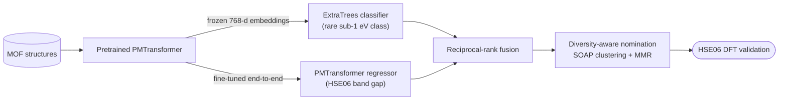

# Screening module — model training and enrichment-driven candidate ranking

**Diversity-aware ensemble learning on pretrained PMTransformer embeddings for retrieving rare-property materials.**

This is the **screening module** of the [rare-property-retrieval](../) repository, demonstrated on low-band-gap MOF discovery (HSE06 gap ≤ 1.0 eV). It fine-tunes a PMTransformer regressor (the [MOFTransformer](https://github.com/hspark1212/MOFTransformer) architecture), trains classical rare-class classifiers on frozen pretrained embeddings, fuses both rankings via Reciprocal Rank Fusion (RRF), and selects validation candidates with a diversity-aware nomination strategy built on SOAP (Smooth Overlap of Atomic Positions) descriptors.

> | Module | Role |
> |---|---|
> | **`screening/`** *(this module)* | Trains the PMTransformer regressor + ExtraTrees classifier; screens & ranks **known** structures |
> | [`generation/`](../generation/) | **Generates** new candidates with PORMAKE, screens them with the models trained here, and runs the **HSE06 DFT** validation |
>
> Accompanies the paper *Enrichment-driven discovery of low-band-gap metal–organic frameworks with
> pretrained porous-material representations* (see [Citation](#citation)). Author: Ege Yiğit Erbil, Koç University.

## Results at a glance

Evaluated retrospectively on a held-out QMOF partition and then deployed prospectively on unseen
structures, the fused ranking turns a sub-1% needle-in-a-haystack search into a tractable shortlist:

- **~122× enrichment** over random screening at a 25-structure validation budget on the held-out test set.
- **Rank rescue:** the regressor buries one true positive at rank 5,942 and the classifier buries a
  *different* one at rank 8,140, yet reciprocal-rank fusion keeps its worst positive at rank 1,793 —
  robust precisely where either model alone fails catastrophically.
- **8 confirmed low-band-gap MOFs** (HSE06 $E_\mathrm{g} \le 1$ eV) across both deployments: **3** from
  unlabelled QMOF (15% validated hit rate) and **5** newly generated frameworks (25% hit rate), the
  latter novel against QMOF, CoRE MOF 2019, hMOF, and ToBaCCo.



The fine-tuned regressor and the rare-class classifier provide **complementary** signals; fusing
their *ranks* (not their scores) inherits each model's strong placements while discarding its
catastrophic ones. Full retrieval curves, enrichment with bootstrap confidence intervals, and the
per-positive rank table are produced by Step 5 and reported in the paper.

---

## Key Contribution

The pipeline extracts two complementary prediction signals from a single foundation model:

1. **Embedding-based ML classifiers** — Fixed 768-dim representations from the pretrained (non-fine-tuned) PMTransformer encoder are used to train lightweight tree classifiers (Extra Trees, Random Forest with SMOTE). This leverages the general structural knowledge learned during pretraining on ~660K MOFs, without modifying the encoder.

2. **Fine-tuned PMTransformer** — The full model is fine-tuned end-to-end for band-gap regression, adapting both encoder and prediction head to the target property.

These two approaches capture complementary signal: the trees operate on frozen general-purpose features while the fine-tuned model has task-adapted features. Their predictions are fused via RRF, and NN-ML disagreement provides an uncertainty signal.

**Diversity-aware candidate nomination (Step 7):** Rather than selecting the top-K candidates by score alone, the nomination pipeline clusters the RRF shortlist in embedding space and applies multiple diversity-aware strategies (cluster-quota round-robin, Maximal Marginal Relevance (MMR), uncertainty-weighted selection, and long-tail exploration). When SOAP descriptors are used as the diversity space instead of PMTransformer embeddings, the resulting nominees achieve greater structural spread — SOAP measures purely geometric/chemical similarity independent of the learned representations used for scoring.

---

## Pipeline Overview

```
  STEP 0   Preprocess CIF files into MOFTransformer format (.grid, .griddata16, .graphdata)
    v
  STEP 1   Extract pretrained 768-dim embeddings → Strategy D farthest-point splits
    v
  STEP 2   Fine-tune PMTransformer for band-gap regression (3 seeds)
    |        ↳ trains on raw MOFTransformer files, NOT on extracted embeddings
    v
  STEP 3   Train 15+ sklearn classifiers + kNN on pretrained embeddings
    |        ↳ uses the frozen 768-dim embeddings from Step 1
    v
  STEP 4   Exhaustive ensemble ablation (all 2/3/4-model combos, optimise recall@50)
    v
  STEP 5   Generate comprehensive analysis report (15+ figures)
    v
  ─ ─ ─ ─ ─ ─  labeled set complete, now switch to unlabeled set  ─ ─ ─ ─ ─ ─
    v
  STEP 6   Discovery — deploy models on ~10K NEW unlabeled MOFs, RRF ranking
    v
  STEP 7   Diversity-aware DFT nomination (cluster + MMR + SOAP verification)
```

> **Labeled vs. unlabeled sets.** Steps 1-5 work on the ~10,810 MOFs with known HSE06 band gaps (only 74 positives — a needle-in-a-haystack retrieval problem). Steps 6-7 work on a **completely separate** set of ~9,561 unlabelled QMOF MOFs that the models have never seen during training, validation, or testing. These are not the test split from Steps 1-5; they are new structures for which we want to discover low-band-gap candidates.

> **NN vs. ML data flow.** The fine-tuned NN (Step 2) reads the raw preprocessed MOF files directly — MOFTransformer handles tokenisation internally. The ML classifiers (Step 3) train on the frozen 768-dim pretrained embeddings extracted in Step 1. Both paths use the same train/val/test split.

---

## Reproducing the paper

The published results come from the **two modules of this repository used together**: this one
(model training and screening) and [`generation/`](../generation/) (new-structure assembly and
DFT validation). To reproduce everything:

**In this module — train the models, screen known MOFs**

1. **Install** (PyTorch/PyG → MOFTransformer → `requirements.txt`) and set `BASE_DIR` / `VENV_PATH` in [scripts/config.sh](scripts/config.sh).
2. **Data (Step 0)** — obtain the HSE06-labelled QMOF set and preprocess the CIFs to MOFTransformer format (see [data/README.md](data/README.md)).
3. **Step 1** — `01_extract_embeddings.sh`: pretrained embeddings + the Strategy D split.
4. **Step 2** — `02_train_nn.sh`: fine-tune the three PMTransformer regressors.
5. **Step 3** — `03_train_ml.sh`: the ExtraTrees / ML classifiers on frozen embeddings.
6. **Steps 4–5** — `04_run_ensemble.sh`, `05_generate_report.sh`: RRF ensemble + report. This reproduces the held-out **enrichment / rank-rescue** numbers.
7. **Steps 6–7** — `06_run_discovery.sh`, `07_nominate_candidates.sh`: screen the unlabelled QMOF pool and nominate a diverse subset. DFT-validating these gives the **3 QMOF hits**.

**Then switch to [`generation/`](../generation/) for the generated-structure arm and all DFT.**
The generation module reuses the models you just trained — point its NN inference `--base_dir`
at this module's directory (it holds `train_regressor.py` + `experiments/`). Follow that
module's “Reproducing the paper”.

### Code, not results

This repository contains the **code and workflow only** — no result files. Everything needed
to re-run the screening arm is committed (the generation + DFT arm lives in
[`generation/`](../generation/)):

| Artifact | Location |
|---|---|
| Exact train/val/test membership lists (1,136 / 524 / 9,150; 60 / 5 / 9 positives) | [`data/splits/strategy_d_farthest_point/`](data/splits/strategy_d_farthest_point/) |
| Pinned dependency freezes (fine-tuning + analysis environments) | [`../env/`](../env/) (repository root) |
| SI input-representation ablation (classifier retrained on SOAP) | [`figures/representation_ablation.py`](figures/representation_ablation.py) |
| Fine-tuning configs matching the paper's Methods exactly (seed 42/123/456) | [`experiments/`](experiments/) |

All result artifacts — the ranked screening tables, curated hit tables, confirmed-hit
structures, pretrained-embedding archives, model checkpoints, and the complete DFT inputs and
outputs for every completed validation — are distributed separately (see the paper's Data
availability statement).

---

## Repository Structure

```
screening/
├── README.md
├── requirements.txt
├── .gitignore
│
├── src/                        # Core Python modules
│   ├── train_regressor.py      #   PMTransformer fine-tuning + metrics
│   ├── embedding_classifier.py #   15+ sklearn classifier training
│   ├── ensemble_discovery.py   #   RRF / exhaustive ensemble ablation
│   ├── knn_baseline.py         #   kNN regression & similarity baselines
│   ├── generate_final_report.py#   Analysis figures & markdown report
│   └── ...                     #   (comparison, reinference, UMAP, etc.)
│
├── data_preparation/           # Embedding extraction & data splitting
│   ├── analyze_embeddings.py
│   ├── embedding_split.py      #   Strategy D farthest-point splits
│   └── extract_unlabeled_embeddings.py
│
├── experiments/                # NN experiment configs (edit run.py per experiment)
│   ├── exp364_fulltune/        #   seed=42,  primary model
│   ├── exp370_seed2/           #   seed=123, ensemble variant
│   └── exp371_seed3/           #   seed=456, ensemble variant
│
├── discovery/                  # Inference & nomination on unlabeled MOFs
│   ├── run_inference_from_cwd.py
│   ├── discovery_pipeline.py
│   ├── ensemble_predictions.py
│   ├── ensemble_report.py
│   ├── plot_model_comparison.py
│   └── nominate_diverse_dft.py #   Step 7: diversity-aware DFT nomination
│
├── figures/                    # Paper figure generation scripts
│   ├── forward_pretrained_embeddings.py   # F1: pretrained PMTransformer → embeddings
│   ├── umap_pretrained.py                 # F2: UMAP of pretrained embeddings
│   ├── forward_finetuned_umap.py          # F3: fine-tuned forward pass + UMAP
│   ├── soap_descriptors_umap.py           # F4: SOAP from CIF files + UMAP
│   ├── soap_validation.py                 # F5: SOAP structural validation
│   ├── umap_ensemble_nominations.py       # F6: ensemble nominations on UMAP
│   ├── umap_dft_nominations.py            # F7: nominated structures + DFT band gap
│   ├── representation_ablation.py         # SI: classifier retrained on SOAP vs embedding
│   └── _splits.py                         # shared split-loading helpers
│
├── scripts/                    # SLURM pipeline orchestration
│   ├── config.sh               #   Centralised cluster configuration
│   ├── 01_extract_embeddings.sh
│   ├── 02_train_nn.sh
│   ├── 03_train_ml.sh
│   ├── 04_run_ensemble.sh
│   ├── 05_generate_report.sh
│   ├── 06_run_discovery.sh
│   ├── 07_nominate_candidates.sh
│   ├── figures/                #   SLURM wrappers for figure generation (F1-F7)
│   └── optional/               #   UMAP, verify ML, reinfer, screening, etc.
│
├── tools/                      # Split modification utilities
│
└── data/                       # Data directory (structures not tracked in Git)
    ├── README.md               #   Dataset format documentation
    └── splits/strategy_d_farthest_point/       #   COMMITTED: the paper's exact split JSONs
```

---

## Getting Started

### Prerequisites

| Requirement | Details |
|-------------|---------|
| SLURM cluster | GPU nodes with CUDA 12.x (Steps 0-2, 6, F1, F3). Steps 3-5, 7 are CPU-only. |
| Python 3.9+ | Tested with Python 3.9.5 |
| MOFTransformer | `pip install moftransformer` ([docs](https://github.com/hspark1212/MOFTransformer)) — needed for Step 0 (preprocessing) and Steps 1-2, 6 (forward passes). |
| MOF structure files | Raw CIF files; preprocessed into MOFTransformer format in Step 0. See [data/README.md](data/README.md). |
| `qmof.csv` *(optional)* | QMOF Database metadata for metal center analysis in figures F2/F3. Download from the [QMOF Database](https://github.com/Andrew-S-Rosen/QMOF) and place at `data/qmof.csv`. |

### Installation

```bash
git clone https://github.com/EYErbil/rare-property-retrieval.git
cd rare-property-retrieval/screening
python -m venv venv && source venv/bin/activate

# 1. Install PyTorch + PyTorch Geometric for your CUDA version first
#    (see https://pytorch.org/get-started and https://pytorch-geometric.readthedocs.io)

# 2. Install MOFTransformer (depends on PyTorch/PyG)
pip install moftransformer

# 3. Install remaining dependencies
pip install -r requirements.txt
```

`requirements.txt` gives permissive version ranges for a fresh install. The **exact** package
versions used for the paper are frozen at the repository root, in
[`../env/requirements_finetuning.txt`](../env/requirements_finetuning.txt)
(model fine-tuning and NN inference) and [`../env/requirements_analysis.txt`](../env/requirements_analysis.txt)
(SOAP, classifiers, nomination, figures) — use those to replicate the paper's environments
bit-for-bit.

### Reproducibility checklist (cold clone)

1. **Clone and environment** — Follow [Installation](#installation) (PyTorch / PyG order matters).
2. **`scripts/config.sh`** — Set `BASE_DIR` to the cloned repo path and `VENV_PATH` to your venv `activate` script. Adjust `MODULE_LOADS` or set it to `""` if you do not use environment modules.
3. **SLURM headers** — Each `scripts/*.sh` file has its own `#SBATCH` partition/account/QoS lines. Edit them to match your site (see [Configuration](#configuration)).
4. **Data you must supply** — The repository includes the paper's exact train/val/test membership lists (`data/splits/strategy_d_farthest_point/*.json`) but **not** the MOF structure files, embeddings, or checkpoints. Build `data/` as described in [data/README.md](data/README.md) (labeled set for Steps 1–5, separate unlabeled set for Steps 6–7). Without these, jobs will fail at Step 1 or 6 with missing-path errors.
5. **Optional inputs** — `data/qmof.csv` (metal-center panels in F2/F3), SOAP cache for Step 7 SOAP run (run F4 first or set `SOAP_EMBEDDINGS` in `07_nominate_candidates.sh`).
6. **`logs/`** — Pipeline scripts create `logs/` automatically; ensure the job working directory is the repo root (the provided scripts `cd` to `BASE_DIR`).

Scripts under `scripts/optional/` may assume extra directories (for example `data/splits/original` for `run_umap_analysis.sh`). Treat them as diagnostics unless you set up those paths.

### Configuration

Edit `scripts/config.sh` — the **only file** with cluster-specific paths:

```bash
export BASE_DIR="/path/to/rare-property-retrieval/screening"
export VENV_PATH="/path/to/venv/bin/activate"
export SLURM_PARTITION_GPU="ai"
export MODULE_LOADS="cuda/12.3 cudnn/8.9.5 python/3.9.5"
```

Each SLURM script also has `#SBATCH` headers for partition/account/QoS hardcoded at the top of the file (e.g., `#SBATCH --account=ai`). Changing `config.sh` alone does **not** update these headers. If your cluster uses different partition or account names, edit both `config.sh` **and** the `#SBATCH` lines at the top of each script you plan to run.

---

## Running the Pipeline

Submit each step after the previous one completes. Check job status with `squeue -u $USER`.

### Step 0: Preprocess CIF Files (one-time, prerequisite)

Before anything else, convert your raw CIF files into MOFTransformer's input format. This produces three files per MOF: `.grid` (energy grid), `.griddata16` (voxelised grid), and `.graphdata` (atom graph). Follow the [MOFTransformer preprocessing guide](https://github.com/hspark1212/MOFTransformer) — the `prepare_data` utility handles this.

Place all preprocessed files under `data/raw/test/` (MOFTransformer expects a parent/split directory layout) and create `data/raw/test_bandgaps_regression.json` mapping every CIF ID to its DFT band-gap value in eV. See [data/README.md](data/README.md) for the expected structure. Keep the original CIF files in `data/raw/cif/` if you plan to run SOAP analysis (F4, Step 7).

### Step 1: Extract Embeddings and Create Splits

```bash
sbatch scripts/01_extract_embeddings.sh    # GPU, ~2-4h
```

Runs a forward pass of the **pretrained** (non-fine-tuned) PMTransformer on every labeled MOF and saves the 768-dim CLS embeddings to `data/embeddings/embeddings_pretrained.npz`. These embeddings serve two purposes: (1) input features for the ML classifiers in Step 3, and (2) the basis for **Strategy D** farthest-point train/val/test splitting, which ensures every positive in val/test has a structurally similar positive in training. The NN in Step 2 does **not** use these embeddings — it reads the raw preprocessed MOF files directly.

> **To reproduce the paper, skip Step 1b's split generation** — the exact published split is
> already committed at `data/splits/strategy_d_farthest_point/`. Run Step 1b only when
> targeting a new dataset or property; the script automatically backs up any existing split
> JSONs (timestamped `backup_*/` subfolder) before writing a fresh split.

### Step 2: Train Neural Network Regressors

```bash
sbatch scripts/02_train_nn.sh              # GPU, ~24-69h
```

Fine-tunes PMTransformer for band-gap regression with three random seeds (`exp364`, `exp370`, `exp371`). Each experiment is configured via `experiments/<name>/run.py` — edit hyperparameters there directly. Key settings: Huber loss, mean pooling, early stopping on validation Spearman rho.

### Step 3: Train ML Classifiers

```bash
sbatch scripts/03_train_ml.sh              # CPU, ~2-6h
```

Trains 15+ sklearn classifiers (Random Forest, SVM, Extra Trees, XGBoost, SMOTE variants, etc.) and kNN baselines on the 768-dim pretrained embeddings. No GPU needed.

### Step 4: Exhaustive Ensemble Ablation

```bash
sbatch scripts/04_run_ensemble.sh          # CPU, ~1-2h
```

Tests every 2/3/4-model combination across multiple fusion methods (RRF, rank averaging, top-K voting, score averaging, weighted RRF, and a logistic-regression stacking meta-learner), plus greedy forward selection and an exhaustive combination search. Reports the optimal combination maximising recall@50 on the labeled test set.

### Step 5: Generate Report

```bash
sbatch scripts/05_generate_report.sh       # CPU, ~15min
```

Produces 15+ figures: recall heatmaps, complementarity analysis, confusion matrices, band-gap distributions, and a markdown summary in `data/final_results/`.

### Step 6: Discovery on Unlabeled MOFs

```bash
sbatch scripts/06_run_discovery.sh         # GPU, ~4-8h
```

> **This uses a completely separate MOF set.** The ~10K unlabeled structures here were never part of the train/val/test split used in Steps 1-5.

Deploys all trained models on unlabeled MOFs. The script: (a) extracts pretrained embeddings for the unlabeled set → `unlabeled_embeddings.npz`, (b) runs ML inference using saved sklearn models, (c) runs NN inference using each fine-tuned checkpoint, and (d) fuses predictions via RRF to produce a consensus ranking. Before running, prepare the data:

1. Preprocess unlabeled CIF files into MOFTransformer format (Step 0)
2. Place them in `data/unlabeled/test/` (or use `discovery/collect_inference_structures.sh` to gather them)
3. Create `data/unlabeled/test_bandgaps_regression.json` mapping CIF IDs to placeholder band-gap values (`0.0`)

Edit `NN_EXPERIMENTS` and `ML_METHODS` at the top of the script to select which models to deploy.

### Step 7: Diversity-Aware DFT Candidate Nomination

```bash
sbatch scripts/07_nominate_candidates.sh   # CPU, ~1-2h
```

This is the final step: selecting 25 structures for DFT band-gap calculation. Rather than taking the top 25 by score, the pipeline ensures structural diversity:

1. **RRF shortlist** — Build a pool of the top 500 candidates from 1 NN + 1 ML model fused by RRF
2. **Cluster** — PCA-50 + KMeans groups the pool into 20 structural clusters
3. **Diverse selection** via four strategies:
   - **A. Cluster-quota round-robin** — best candidate per cluster, cycling until budget is filled
   - **B. Maximal Marginal Relevance (MMR)** — iteratively picks the candidate that best balances quality and distance from already-selected nominees
   - **C. Uncertainty-weighted quota** — like A, but ranks within clusters by a combined quality + NN-ML disagreement score
   - **D. Long-tail exploration** — reserves 5 slots for high-disagreement structures outside the top-500 pool
4. **Combined list** — structures nominated by the most strategies are selected first

The script runs twice: once using PMTransformer embeddings as the diversity space, once using SOAP descriptors. SOAP-based diversity is preferred because it provides a purely geometric measure of structural similarity, independent of the learned representations.

**SOAP embeddings for Step 7:** The SOAP run requires a precomputed `soap_descriptors.npz` file. This is produced as a side-effect of running **F4** (`scripts/figures/04_soap_descriptors_umap.sh`), which computes SOAP descriptors for all MOFs and caches them. After running F4, set `SOAP_EMBEDDINGS` at the top of `scripts/07_nominate_candidates.sh` to point to the cached file (e.g., `figures_output/soap_umap/soap_descriptors.npz`). If SOAP embeddings are not available, the script will only run the PMTransformer-based nomination.

**Key parameters** (edit at the top of `scripts/07_nominate_candidates.sh`):

| Parameter | Default | Description |
|-----------|---------|-------------|
| `NN_EXP` | `exp364_fulltune` | Which NN experiment to use |
| `ML_METHOD` | `extra_trees` | Which ML classifier to use |
| `POOL_SIZE` | `500` | Size of RRF shortlist pool |
| `N_CLUSTERS` | `20` | Number of KMeans clusters |
| `BUDGET` | `25` | Number of structures to nominate |
| `EXPLORATION_BUDGET` | `5` | Slots reserved for long-tail picks |

**Outputs:**

```
data/unlabeled/nomination-PMT/      # PMTransformer-space run (always produced)
├── FINAL_TOP25_diverse.txt          # The 25 CIF IDs for DFT
├── FINAL_TOP25_diverse.csv          # rank, cif_id, rrf_rank, strategies_nominating, rank_std, rank_range, nn_ml_disagreement, cluster
├── COMBINED_top25.txt               # union, ranked by how many strategies nominated each
├── A_cluster_quota_top25.txt        # one file per selection strategy (A/B/C/D)
├── B_mmr_lambda0.3_top25.txt        #   (one B file per MMR lambda)
├── C_uncertainty_quota_top25.txt
├── D_longtail_exploration_top25.txt
├── shortlist_pool.csv               # Full shortlist with cluster assignments
├── diversity_report.md              # Methodology and comparison with old nominees
└── plots/                           # UMAP visualisations
```

The second (SOAP) run writes an analogous `data/unlabeled/nomination-SOAP/` directory, but only when
`SOAP_EMBEDDINGS` is set (see above).

---

## Customisation

### Adding a new NN experiment

```bash
cp -r experiments/exp364_fulltune experiments/exp999_my_experiment
# Edit experiments/exp999_my_experiment/run.py — change seed, LR, freeze_layers, etc.
cd experiments/exp999_my_experiment && sbatch run.sh
```

The ensemble ablation (Step 4) automatically discovers all experiments with `test_predictions.csv`.

### Key hyperparameters (in each experiment's `run.py`)

| Parameter | Default (experiments) | Effect |
|-----------|-----------------------|--------|
| `seed` | 42 / 123 / 456 | Different initialisation for ensemble diversity |
| `freeze_layers` | `0` | 0 = full finetune; 1-3 = freeze bottom layers |
| `pooling_type` | `"mean"` | Mean-pool token features (CLS is the CLI default) |
| `learning_rate` | `1e-4` | Base LR for transformer backbone |
| `lr_mult` | `10.0` | Regression head trains at 10x backbone LR |
| `weight_decay` | `0.01` | AdamW weight decay |
| `loss_type` | `"huber"` | Robust to outlier band gaps (vs MSE) |
| `es_monitor` | `val/spearman_rho` | Early-stopping metric (ranking-aligned) |
| `patience` | `15` | Early stopping patience (epochs) |

> These values are set in each `experiments/<name>/run.py` and **override** the
> `train_regressor.run()` CLI defaults (which are CLS pooling, `val/recall@100` early stopping,
> `freeze_layers=2`, `weight_decay=0.05`, and sample weighting on). Run an experiment's `run.py`
> rather than `train_regressor.py` directly to reproduce the paper's settings.

### Optional analysis scripts

```bash
sbatch scripts/optional/run_umap_analysis.sh        # UMAP embedding visualisations
sbatch scripts/optional/run_verify_ml.sh             # ML performance heatmap
sbatch scripts/optional/run_reinfer.sh               # Recompute NN predictions from checkpoints
sbatch scripts/optional/run_screening.sh             # Two-signal candidate screening (NN + kNN)
sbatch scripts/optional/run_discovery_ml_only.sh     # ML-only inference (CPU, no GPU)
sbatch scripts/optional/run_discovery_nn_only.sh     # NN-only inference (GPU)
sbatch scripts/optional/run_model_comparison.sh      # NN vs ML UMAP investigation
```

---

## Paper Figures and Analysis

The `figures/` directory generates all publication figures. These scripts fit into the main pipeline at two points:

- **F1-F5** can run after Step 5 (once all models are trained) to visualise the embedding spaces — useful before committing to candidate nomination.
- **F6-F7** require Step 7 outputs (nomination lists) and, for F7, completed DFT calculations on the nominated structures.

Some scripts **compute embeddings** (PMTransformer forward pass or SOAP descriptors), others **plot UMAPs**, and some do both. Labeling (labeled vs. unlabeled) is determined automatically from your split JSONs — no manual annotation needed.

### `qmof.csv` (optional, for metal center panels)

Scripts F2 and F3 produce a metal-center UMAP panel (panel c) that colors each MOF by its central metal atom. This requires `qmof.csv` from the [QMOF Database](https://github.com/Andrew-S-Rosen/QMOF) — specifically the `name` and `info.formula` columns. Download it and place it at `data/qmof.csv` (the path set by `$QMOF_CSV` in `config.sh`). If the file is missing, the metal center panel will display "Unknown" for all MOFs. This file is too large to include in the repository.

### What each script does

| Script | What it computes | GPU? |
|--------|-----------------|------|
| `forward_pretrained_embeddings.py` | Runs **pretrained PMTransformer** on ALL MOFs → 768-dim embeddings NPZ | GPU |
| `umap_pretrained.py` | Takes embeddings from F1 → 4-panel UMAP (labeled/unlabeled, band gap, metal center, splits) | CPU |
| `forward_finetuned_umap.py` | Runs **fine-tuned PMTransformer** on ALL MOFs → embeddings + 4-panel UMAP (incl. metal center) | GPU |
| `soap_descriptors_umap.py` | Computes **SOAP descriptors from CIF files** → 4-panel UMAP (NN-independent) | CPU |
| `soap_validation.py` | SOAP structural validation: coverage, structure-band-gap correlation, Mantel test | CPU |
| `umap_ensemble_nominations.py` | Overlays the 25 nominated structures on fine-tuned UMAPs | CPU |
| `umap_dft_nominations.py` | Shows the 25 nominated structures colored by their DFT band gap | CPU |

### Dependency diagram

```
F1 (pretrained forward pass)  ──→ F2 (pretrained UMAP, +metal center panel if qmof.csv)
                               ──→ F5 (SOAP validation, needs F1 + CIF)
                               ──→ F7 (DFT nomination UMAP, needs F1 + bandgap_results.csv)

F3 (finetuned forward pass)   ──→ F6 (ensemble nominations on finetuned UMAPs)
                               ──→ F7 (optional finetuned overlay)

F4 (SOAP from CIF)             [independent — only needs CIF files and split JSONs]
```

### Running the figure pipeline

| Step | Command | Time |
|------|---------|------|
| **F1** | `sbatch scripts/figures/01_forward_pretrained_embeddings.sh` | GPU, ~2-4h |
| **F2** | `sbatch scripts/figures/02_umap_pretrained.sh` | CPU, ~30min |
| **F3** | `sbatch scripts/figures/03_forward_finetuned_umap.sh` | GPU, ~6-8h |
| **F4** | `sbatch scripts/figures/04_soap_descriptors_umap.sh` | CPU, ~2-4h |
| **F5** | `sbatch scripts/figures/05_soap_validation.sh` | CPU, ~1-2h |
| **F6** | `sbatch scripts/figures/06_umap_ensemble_nominations.sh` | CPU, ~1h |
| **F7** | `sbatch scripts/figures/07_umap_dft_nominations.sh` | CPU, ~30min |

**Quick start:** Run F1 first (GPU), then F2 and F4 can run in parallel (CPU). F3 can also run in parallel with F1 if GPU resources allow. F5-F7 depend on earlier outputs as shown above.

Each SLURM wrapper sources `scripts/config.sh` and uses `$CIF_DIR`, `$QMOF_CSV`, `$FIGURES_OUTPUT`, `$SPLITS_DIR`. Edit the wrapper scripts to configure experiment names, nomination file paths, and optional arguments (e.g., `--load_umap_cache` for fast re-runs after the first UMAP computation).

All generated figures go to `figures_output/` (git-ignored). Each script also saves a JSON summary with statistics alongside the plots.

---

## Data

Each MOF is represented by three files (`.grid`, `.griddata16`, `.graphdata`) in MOFTransformer format. Labels are JSON files mapping CIF IDs to band-gap values in eV; the classification threshold is **band gap < 1.0 eV** (positive = potentially conductive). See [data/README.md](data/README.md) for format details.

| Dataset | MOFs | Purpose |
|---------|------|---------|
| Labeled (QMOF, HSE06 level) | ~10,810 | Training + evaluation (Steps 1-5) |
| Unlabeled (QMOF pool) | ~9,561 | Discovery screening (Steps 6-7) |

The labeled set is split via Strategy D farthest-point coverage into 1,136 train (60 positives), 524 val (5 positives), and 9,150 test (9 positives) structures — 74 positives among 10,810 labelled MOFs in total. The extreme imbalance (0.10% positive rate in test, 0.68% across the labelled set) makes this a needle-in-a-haystack retrieval problem evaluated by recall@K.

> **The paper's exact split is committed.** The final membership lists used in the manuscript are
> released at [`data/splits/strategy_d_farthest_point/`](data/splits/strategy_d_farthest_point/)
> (`{train,val,test}_bandgaps_regression.json`, structure name → HSE06 gap in eV). Use these to
> reproduce the paper. Re-running Step 1 regenerates a Strategy D split from scratch — the final
> published split additionally received manual curation (see `tools/`), so a regenerated split is
> *not* guaranteed to match the released one.

---

## Key Design Decisions

| Decision | Rationale |
|----------|-----------|
| **Strategy D farthest-point split** | Guarantees every val/test positive has a structurally similar training positive, yielding honest recall metrics. |
| **Pretrained embeddings for ML** | The 768-dim PMTransformer CLS token is a powerful structural fingerprint before any fine-tuning, providing an independent retrieval signal complementary to the fine-tuned regression model. |
| **Multi-seed NN training** | Same architecture, different seeds produce models that agree on easy cases but disagree on hard ones, making ensemble fusion effective. |
| **Reciprocal Rank Fusion** | Rank-based fusion handles heterogeneous score scales (regression logits vs classification probabilities) without normalisation artifacts. |
| **Huber loss + Spearman early stopping** | Huber is robust to outlier band gaps; Spearman rho measures ranking quality, aligning training with the discovery objective. |
| **1 NN + 1 ML for nomination** | Simpler than multi-model ensembles; diversity comes from SOAP-based selection rather than model proliferation. Ensemble experiments with 3 NN + 2 ML remain available via Step 4. |
| **SOAP diversity lens** | SOAP descriptors provide a purely geometric/chemical measure of structural dissimilarity, independent of the model features. This prevents the nominees from clustering in a learned-feature artifact. |
| **Long-tail exploration** | Reserves 5 of the 25 slots for high-uncertainty structures outside the main pool — a hedge against the ensemble's blind spots. |

---

## Applying the pipeline to other rare-event discovery tasks

Nothing in this pipeline is specific to band gaps. It implements a general recipe for
retrieving rare, expensively-labelled materials: a rare-class classifier on frozen pretrained
embeddings, a fine-tuned regressor, reciprocal-rank fusion of the two rankings, a
disagreement-driven exploration tier, and diversity-aware nomination under a fixed validation
budget. To target a different property:

1. **Labels** — the label files are plain JSON maps from structure ID to a scalar property
   (see [data/README.md](data/README.md)). Replace the band-gap values with any property for
   which high-fidelity labels are scarce and positives are rare — electrical conductivity,
   adsorption selectivity, catalytic descriptors, magnetic or mechanical targets. Keep the
   `*_bandgaps_regression.json` filenames and the `bandgaps_regression` downstream identifier
   unchanged: they are fixed pipeline identifiers shared by both repositories, not statements
   about the property — only the values inside the JSONs change.
2. **Positive-class definition** — the rare-event threshold (here HSE06 gap ≤ 1 eV) is a single
   parameter (`threshold` in `experiments/<name>/run.py` and in the classifier training).
   Redefine it for the property and rarity regime of interest.
3. **Representation** — the frozen PMTransformer embedding transfers across porous-material
   property tasks. For chemistries outside its pretraining domain, substitute any embedding that
   yields one fixed-length vector per structure (an NPZ with `cif_ids` + `embeddings`): the
   classifier, rank fusion, nomination, and evaluation stages are representation-agnostic.
4. **Validation oracle** — the DFT cascade (in [`generation/`](../generation/)) is one instance
   of an expensive high-fidelity oracle. Any scarce, costly measurement or simulation can take
   its place; the same early-recognition metrics (EF@k, precision@k, recall@k) quantify success.

## Related module

The models trained here are reused by the [`generation/`](../generation/) module to score
newly assembled frameworks and to drive their PBE-D3(BJ) → HSE06 DFT validation.

## Citation

If you use this software, please cite the accompanying paper:

> Erbil, E. Y. *et al.* Enrichment-driven discovery of low-band-gap metal–organic frameworks with
> pretrained porous-material representations. *Manuscript in preparation* (2026).

```bibtex
@article{erbil2026lowgapmof,
  title   = {Enrichment-driven discovery of low-band-gap metal--organic frameworks
             with pretrained porous-material representations},
  author  = {Erbil, Ege Yi{\u{g}}it and others},
  year    = {2026},
  note    = {Manuscript in preparation}
}
```
To cite this software repository specifically, see the [repository-level README](../README.md).

## Acknowledgements

Built on **[MOFTransformer / PMTransformer](https://github.com/hspark1212/MOFTransformer)** (pretrained
porous-material representation), the **[QMOF Database](https://github.com/Andrew-S-Rosen/QMOF)** (HSE06
band gaps), **[DScribe](https://github.com/SINGROUP/dscribe)** (SOAP descriptors),
**[scikit-learn](https://scikit-learn.org/)**, **[XGBoost](https://xgboost.readthedocs.io/)**, and
**[UMAP](https://github.com/lmcinnes/umap)**.

## License

Released under the [MIT License](../LICENSE) © 2025 Ege Yiğit Erbil, Koç University.
